# Build your own

Everything in OpenCDaRR that you might change is either a plain value or an interface with a single method, so extending it means writing one small class (or one value) and passing it in. The loop never changes.

This page builds a whole encounter that way. We start from a built-in ownship, give it an intruder whose airframe is entirely our own, run the crossing with a built-in resolver and then with a resolver we write ourselves, layer on sensing and communication uncertainty, and finish by repeating the encounter hundreds of times to read a safety rate off the aggregate. Each extensible piece also has its own reference page for the details:

- **[Performance](performance.md)** — the flight envelope of an airframe.
- **[Kinematics](kinematics.md)** — how a vehicle moves.
- **[Autopilot](autopilot.md)** — the nominal command that follows a mission.
- **[Separation Manager](separation-manager/index.md)** — build your own [conflict detection](separation-manager/conflict-detection.md), [resolution](separation-manager/conflict-resolution.md), and [recovery](separation-manager/recovery-criteria.md), and combine them into one object.
- **[CNS](cns/index.md)** — navigation, communication, and surveillance.

The scenario stays fixed throughout — two aircraft on crossing legs, spawned directly in conflict — so every change is attributable to the one piece we swap.

## An aircraft from the built-in models

Each aircraft is an [`Agent`](https://github.com/fazlurnu/OpenCDaRR/blob/main/opencdarr/fleet.py): a start state, an airframe (a [`Kinematics`](kinematics.md) + a [`Performance`](performance.md) envelope), and an [`Autopilot`](autopilot.md). The ownship is a multirotor cruising north, flown by the built-in `M600` envelope and `Multirotor` model; a [`CruiseAutopilot`](autopilot.md) holds its track and speed whenever it is not avoiding.

```python
from opencdarr.kinematics import Multirotor
from opencdarr.fleet import Agent, run_fleet
from opencdarr.performance import M600
from opencdarr.autopilot import CruiseAutopilot
from opencdarr.scenario import create_conflict
from opencdarr.state import AircraftState

copter = AircraftState(id="COPTER", lat=52.0, lon=4.0, trk=0.0, gs=18.0, yaw=0.0)
agent_copter = Agent(copter, M600, Multirotor(), CruiseAutopilot(copter.trk, copter.gs))
```

## Your own kinematics and performance

Every airframe is two swappable values, so the intruder can be entirely your own. A [`Kinematics`](kinematics.md) is any class implementing `step`; the simplest useful one follows the commanded ground velocity and keeps the odometry — it does not even read the envelope, or account for wind, which is fine for a first sketch. Its [`Performance`](performance.md) is a heavy, slow cargo drone.

```python
from opencdarr.kinematics.base import Kinematics, MotionCommand, odometry_update
from opencdarr.performance import Performance
from opencdarr.wind import NO_WIND
from opencdarr import geo
import math
from dataclasses import replace

class VelocityFollower(Kinematics):
    def step(self, state, command, perf, dt, wind=NO_WIND):
        v_east, v_north = command.v_east, command.v_north           # raises if no velocity set
        speed = math.hypot(v_east, v_north)
        trk = state.trk if speed <= perf.v_max else math.degrees(math.atan2(v_east, v_north)) % 360.0
        lat, lon = geo.forward(state.lat, state.lon, trk, speed * dt)
        return replace(state, lat=float(lat), lon=float(lon), trk=trk, gs=speed,
                       **odometry_update(state, speed, dt))

CARGO = Performance(v_max=12.0, v_min=-12.0, ax=1.5, yaw_rate_max=40.0)
```

Rather than hand-place the intruder, [`create_conflict`](https://github.com/fazlurnu/OpenCDaRR/blob/main/opencdarr/scenario.py) returns one whose straight leg loses separation with the ownship a chosen number of seconds from now — here a 90° crossing, 30 s out, later than the 20 s look-ahead so nothing is flagged at spawn.

```python
cargo = create_conflict(copter, intr_id="CARGO", dpsi=90.0, dcpa=0.0,
                        tlos=30.0, rpz=50.0, gs_intr=10.0, side=1)
agent_cargo = Agent(cargo, CARGO, VelocityFollower(), CruiseAutopilot(cargo.trk, cargo.gs))

agents = [agent_copter, agent_cargo]
```

## The first run — no resolution

[`run_fleet`](https://github.com/fazlurnu/OpenCDaRR/blob/main/opencdarr/fleet.py) advances the whole fleet to termination. With no resolver, both aircraft simply fly their plans into each other — the baseline that shows the conflict is real.

```python
from opencdarr.cd import StateBased
from opencdarr.viz import plot_pairwise

run = run_fleet(
    agents, rpz=50.0, t_lookahead=20.0, dt=0.1,
    detector=StateBased(), resolver=None, recovery=None,
    done_timeout=10.0, record=True,
)
print(run.min_sep, run.los)   # 0.6 m  True  — they collide
fig = plot_pairwise(run, rpz=50.0, title="Pairwise crossing (perfect information), no reso")
```

<figure markdown="span">
  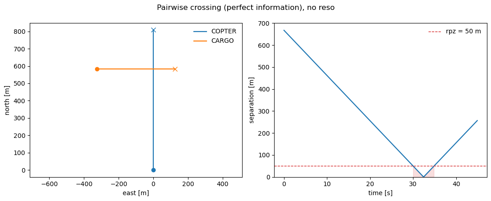
  <figcaption>No resolver: the legs cross and separation collapses to 0.6 m, deep inside the 50 m protected zone.</figcaption>
</figure>

## Adding a resolver

The separation stack is three swappable pieces — a [detector](separation-manager/conflict-detection.md), a [resolver](separation-manager/conflict-resolution.md), and a [recovery criterion](separation-manager/recovery-criteria.md). Adding a built-in `MVP` resolver and a `PastCPA` recovery — the only two arguments that change — is enough to clear the crossing.

```python
from opencdarr.cr import MVP
from opencdarr.crr import PastCPA

run = run_fleet(
    agents, rpz=50.0, t_lookahead=20.0, dt=0.1,
    detector=StateBased(), resolver=MVP(), recovery=PastCPA(bouncing_guard=True),
    done_timeout=10.0, record=True,
)
print(run.min_sep, run.los)   # 97.7 m  False  — clear
```

<figure markdown="span">
  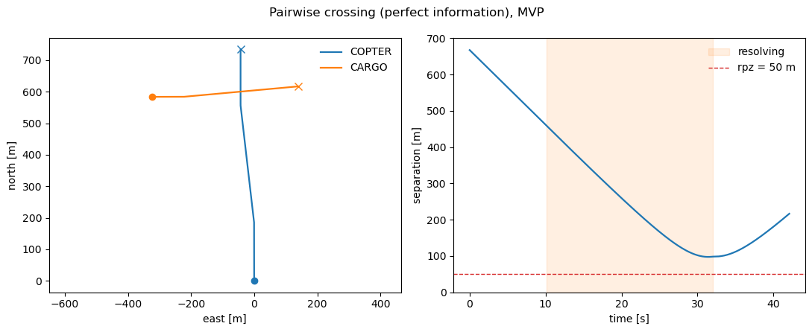
  <figcaption>With `MVP` and `PastCPA`, each aircraft turns off its plan in time and the closest approach holds at 97.7 m.</figcaption>
</figure>

## Your own resolver

A [resolver](separation-manager/conflict-resolution.md) is likewise just a class with a `resolve` method returning a `MotionCommand`. A deliberately crude one — hold course until an intruder is within `trigger` metres, then turn 90° right — drops straight in.

```python
from opencdarr.cr.base import ConflictResolver
from opencdarr.relative import velocity_enu, relative_enu
from collections.abc import Sequence

class CloseRangeAvoid(ConflictResolver):
    """Hold course until an intruder is within `trigger` m, then turn 90 deg right."""

    def __init__(self, trigger: float = 70.0) -> None:
        self.trigger = trigger

    def resolve(self, own: AircraftState, intruders: Sequence[AircraftState],
                rpz: float, preferred: tuple[float, float] | None = None) -> MotionCommand:
        v_east, v_north = velocity_enu(own)
        nearest = min((relative_enu(own, i).dist for i in intruders), default=float("inf"))
        if nearest <= self.trigger:
            return MotionCommand(target_velocity=(v_north, -v_east))   # 90 deg right, same speed
        return MotionCommand(target_velocity=(v_east, v_north))        # else: unchanged
```

Swapping it in is one argument — `resolver=CloseRangeAvoid(120)`, the rest of the call unchanged. Because it reacts only at close range and turns blindly, it is weaker than `MVP`: the pair grazes the protected zone here.

<figure markdown="span">
  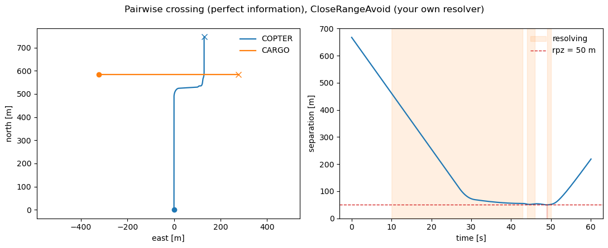
  <figcaption>`CloseRangeAvoid(120)`: a late, blunt 90° turn brings the closest approach to 49.9 m — a marginal loss of separation, and a reminder that the resolver is yours to improve.</figcaption>
</figure>

## Sensing and communication uncertainty

So far every aircraft has acted on the truth. To make it realistic we turn on GNSS self-noise: each aircraft measures its own state with an error before acting and broadcasting. That is one argument — [`navigation`](cns/navigation.md) — plus the noise magnitude on each state and a seeded random stream.

```python
from opencdarr.cns.navigation import GnssNavigation
from opencdarr import rng

noisy_agents = [replace(a, state=replace(a.state, pos_ci95=15.0, vel_ci95=1.5)) for a in agents]

noisy_run = run_fleet(
    noisy_agents, rpz=50.0, t_lookahead=20.0, dt=0.5,
    detector=StateBased(), resolver=MVP(), recovery=PastCPA(bouncing_guard=True),
    navigation=GnssNavigation(), rng=rng.generator(rng.root_seed_sequence(42)),
    stop_within=100.0, done_timeout=60.0, record=True,
)
print(noisy_run.min_sep, noisy_run.los)   # 102.5 m  False
```

<figure markdown="span">
  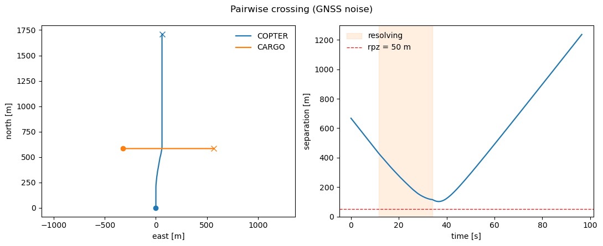
  <figcaption>With a 15 m / 1.5 m·s⁻¹ GNSS error each aircraft acts on a slightly wrong self-fix, so the path differs — here it clears at 102.5 m.</figcaption>
</figure>

Communication uncertainty layers on the same way. A directed [`Comm`](../modules/cns/communication.md) model gives each transmission direction its own reception probability — `COPTER→CARGO` is more reliable than the reverse — over a lognormal latency, on its own reproducible stream.

```python
from opencdarr.cns import Comm, lognormal_latency

nav_seq, comm_seq = rng.spawn(rng.root_seed_sequence(42), 2)   # independent nav / comm streams

comm = Comm(
    reception_prob={("COPTER", "CARGO"): 0.9, ("CARGO", "COPTER"): 0.6},   # directed, asymmetric
    latency=lognormal_latency(median=0.5, sigma=0.4),                      # seconds
)

# the same run, now also given:  communication=comm,  comm_rng=rng.generator(comm_seq)
noisy_run = run_fleet(
    noisy_agents, rpz=50.0, t_lookahead=20.0, dt=0.5,
    detector=StateBased(), resolver=MVP(margin=1.1), recovery=PastCPA(bouncing_guard=True),
    navigation=GnssNavigation(), rng=rng.generator(nav_seq),
    communication=comm,          comm_rng=rng.generator(comm_seq),
    stop_within=100.0, done_timeout=60.0, record=True,
)
print(noisy_run.min_sep, noisy_run.los)   # 84.6 m  False
```

<figure markdown="span">
  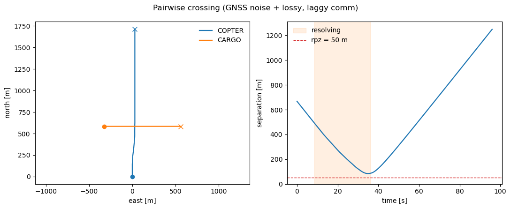
  <figcaption>Adding dropped and delayed broadcasts pulls the closest approach down to 84.6 m — still clear, but with less margin.</figcaption>
</figure>

## One run is a sample — a Monte Carlo

That noisy run cleared, but a different seed draws different errors, so it is one sample of a random outcome. The safety metric is the aggregate over many independent repeats — one substream per run, all spawned from a single root seed, so the whole batch is fixed by that seed alone and each run draws independent navigation *and* communication noise.

```python
n_runs = 200
outcomes = [
    run_fleet(
        noisy_agents, rpz=50.0, t_lookahead=20.0, dt=0.2,
        detector=StateBased(), resolver=MVP(), recovery=PastCPA(bouncing_guard=True),
        navigation=GnssNavigation(), rng=rng.generator(nav_seq),
        communication=comm,          comm_rng=rng.generator(comm_seq),
        stop_within=100.0, done_timeout=60.0, record=True,
    )
    for nav_seq, comm_seq in (rng.spawn(sub, 2) for sub in rng.spawn(rng.root_seed_sequence(42), n_runs))
]

lost = sum(o.los for o in outcomes)
min_seps = [o.min_sep for o in outcomes]
print(f"{lost}/{n_runs} lost separation; dCPA min {min(min_seps):.1f} m, "
      f"median {sorted(min_seps)[n_runs // 2]:.1f} m")   # 0/200 lost; min 56.5 m, median 96.7 m
```

Two views of the same sweep: [`plot_pairwise_montecarlo`](https://github.com/fazlurnu/OpenCDaRR/blob/main/opencdarr/viz.py) overlays every run's ground tracks, and a histogram of the closest approaches shows the margin distribution.

<figure markdown="span">
  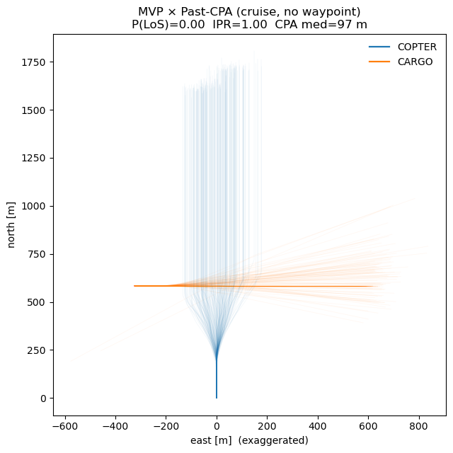
  <figcaption>200 noisy repeats of the crossing (cruise, no waypoint). The dense core is where the fleet usually goes; the faint threads are the noise tails.</figcaption>
</figure>

<figure markdown="span" style="max-width: 32rem; margin-inline: auto;">
  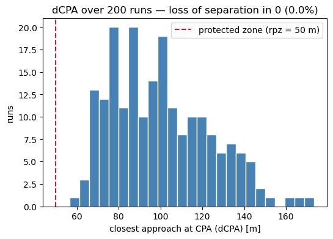
  <figcaption>The closest approach (dCPA) over the 200 runs: none crosses the protected zone, spread from 56.5 m to the high nineties (median 96.7 m).</figcaption>
</figure>

## Waypoint mission

Give the copter a bounded mission — a waypoint 75 s of cruise ahead — instead of an open-ended cruise, and repeat the sweep. Only the ownship's [autopilot](autopilot.md) changes.

```python
from opencdarr.autopilot import WaypointAutopilot
from opencdarr.mission import Mission

wp_copter = geo.forward(copter.lat, copter.lon, copter.trk, copter.gs * 75.0)
agent_copter = Agent(copter, M600, Multirotor(), WaypointAutopilot(Mission(goto=wp_copter)))

agents = [agent_copter, agent_cargo]
noisy_agents = [replace(a, state=replace(a.state, pos_ci95=15.0, vel_ci95=1.5)) for a in agents]
# ... the same 200-run sweep  ->  0/200 lost; dCPA min 56.5 m, median 95.9 m
```

<figure markdown="span">
  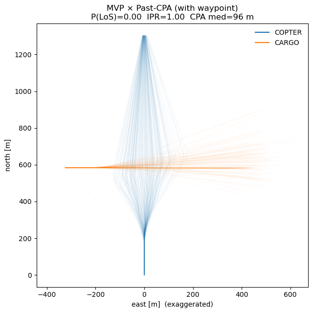
  <figcaption>With a waypoint the copter's tracks pinch toward its goal, but the safety picture is unchanged — 0/200 lost, median 95.9 m.</figcaption>
</figure>

<figure markdown="span" style="max-width: 32rem; margin-inline: auto;">
  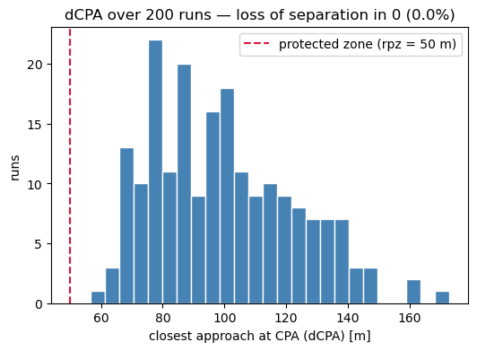
  <figcaption>The dCPA distribution for the waypoint sweep — still clear of the protected zone across all 200 runs.</figcaption>
</figure>

## Wind

Finally, a constant wind. One line builds the field, one argument passes it in.

```python
from opencdarr.wind import WindField

wind = WindField.from_met(coming_from_deg=270.0, speed=10.0)   # constant 10 m/s from the west
# ... the same sweep, now with  wind=wind  in run_fleet  ->  2/200 lost; dCPA min 34.8 m, median 96.7 m
```

The wind now tips a couple of runs into a loss of separation. One caveat matters for reading this: **`VelocityFollower` ignores the wind.** It reads only the commanded velocity, so the `wind` argument passes through unused — only the wind-aware `Multirotor` copter crabs and loses margin, while the cargo drone flies as if the air were still. Modelling wind on the cargo would mean giving its kinematics a wind term.

<figure markdown="span">
  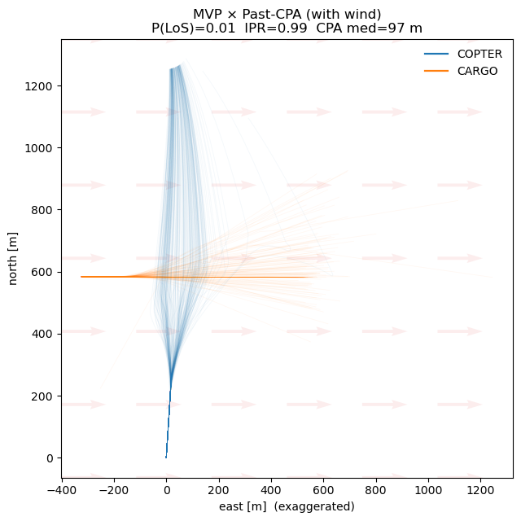
  <figcaption>The same sweep in a 10 m/s westerly (faint arrows point downwind, to the east). Only the copter responds to the wind; its margin erodes and two of the 200 runs enter the protected zone.</figcaption>
</figure>

<figure markdown="span" style="max-width: 32rem; margin-inline: auto;">
  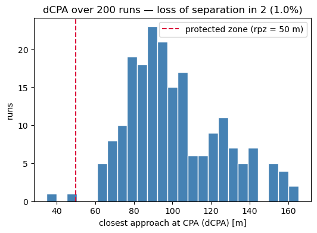
  <figcaption>With wind the low tail reaches 34.8 m and a small mass falls left of the protected zone — the 2/200 losses (a ~1% rate).</figcaption>
</figure>

Two hundred runs are enough to *see* a rate near 1%, but far too few to resolve the much smaller probabilities a real safety target asks for. Estimating those needs [rare-event simulation](../rare-event/index.md).

Every piece built above has its own reference page in this section and under [Modules](../modules/index.md); the [Environments](../environments/pairwise.md) section runs this same conflict at scale. For the same walkthrough with only the built-in models — the shortest path to a first result — see [A first run](../first-run.md).

!!! note "Run it yourself"
    Every step on this page is the notebook [`examples/handbook/build-your-own-distilled.ipynb`](https://github.com/fazlurnu/OpenCDaRR/blob/main/examples/handbook/build-your-own-distilled.ipynb), top to bottom — the custom airframe and resolver, each run, and all three Monte-Carlo sweeps.
