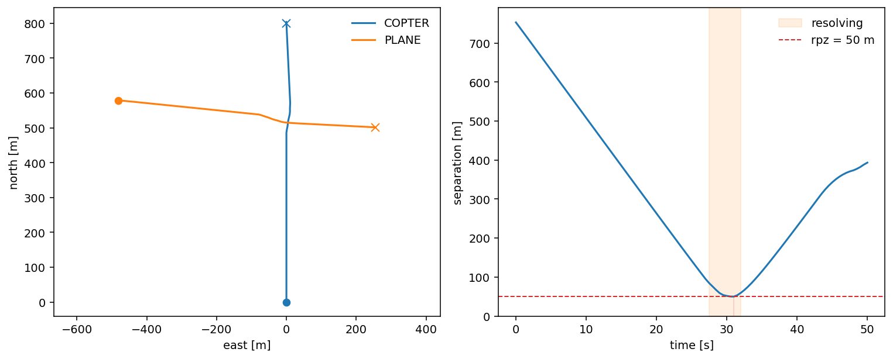
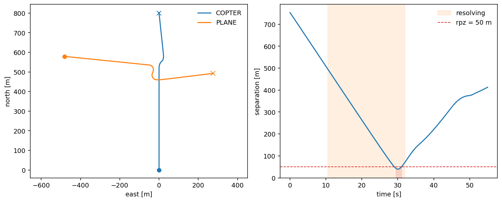
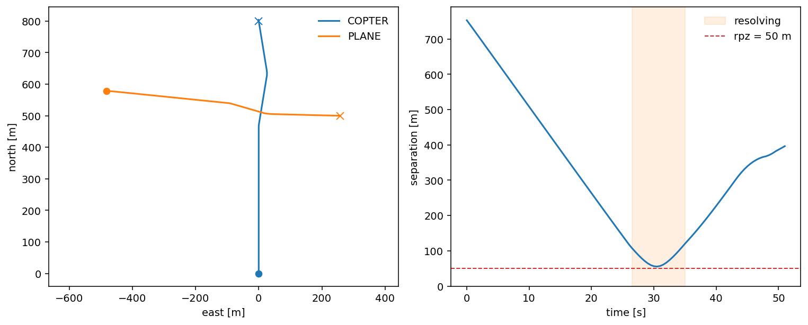
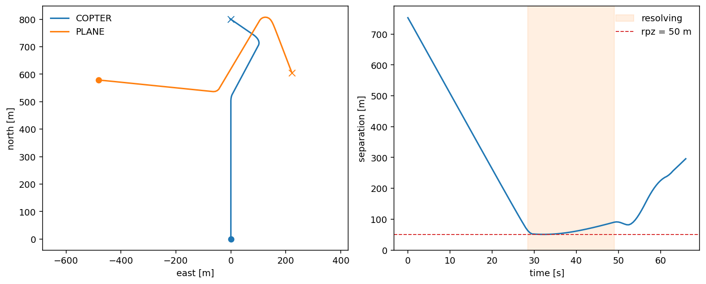
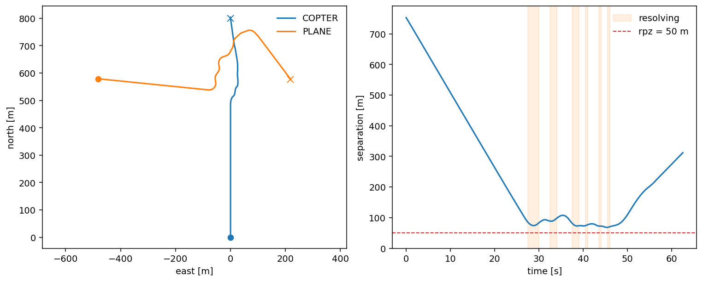
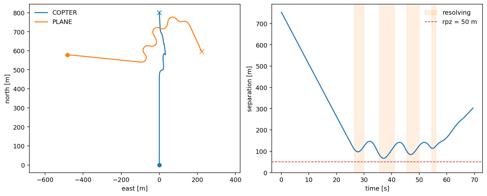
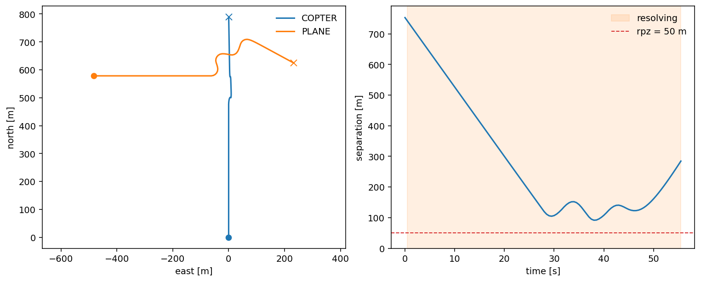

# Separation Manager

The separation manager is the one piece in this section you do **not** subclass. It is the orchestrator: each decision step it runs three pluggable strategies in turn and overlays their result on the aircraft's nominal command.

1. **Conflict detection** — predicts whether the two will lose separation.
2. **Conflict resolution** — computes the velocity that avoids it.
3. **Recovery** — decides when it is safe to stop avoiding and return to the mission.

Each of the three is an abstract base class with a single method, and each has a default: **`StateBased`**, **`MVP`**, and **`PastCPA`**. To build your own you subclass the one you care about, implement that one method, and pass the instance to `run_fleet`. Nothing else — the loop, the fleet, the other two strategies — changes.

| stage | base class | method to implement | returns |
|---|---|---|---|
| [detection](#conflict-detection) | `ConflictDetector` | `detect(own, intr, rpz, t_lookahead)` | `bool` |
| [resolution](#conflict-resolution) | `ConflictResolver` | `resolve(own, intruders, rpz, preferred)` | `MotionCommand` |
| [recovery](#recovery) | `RecoveryCriterion` | `should_resume(own, intr, rpz)` | `bool` |

All three are **directed** (computed from ownship's point of view against its perceived traffic) and **pure** — a function of their arguments only, with no state stored on the object between calls. That purity is what lets a run be reproduced exactly and a rare-event particle be cloned safely.

!!! tip "A runnable version"
    Every example below is drawn from [`examples/02_build_your_own_separation_manager.ipynb`](https://github.com/fazlurnu/OpenCDaRR/blob/main/examples/02_build_your_own_separation_manager.ipynb), which runs top to bottom after `pip install -e ".[examples]"`. The figures on this page are its output.

## The scaffold

All the examples share one encounter — a multirotor cruising north, a fixed-wing placed to cross it — and a small helper that runs it with the defaults unless you override one strategy:

```python
from opencdarr.fleet import Agent, run_fleet
from opencdarr.kinematics import FixedWing, Multirotor
from opencdarr.performance import M600, SMALL_FIXEDWING
from opencdarr.autopilot import WaypointAutopilot
from opencdarr.mission import Mission
from opencdarr.scenario import create_conflict
from opencdarr.state import AircraftState
from opencdarr import geo
from opencdarr.cd import StateBased
from opencdarr.cr import MVP
from opencdarr.crr import PastCPA

copter = AircraftState(id="COPTER", lat=52.0, lon=4.0, trk=0.0, gs=18.0, yaw=0.0)
plane = create_conflict(copter, intr_id="PLANE", dpsi=90.0, dcpa=0.0,
                        tlos=30.0, rpz=50.0, gs_intr=15.0, side=1)
agents = [
    Agent(copter, M600, Multirotor(),
          WaypointAutopilot(Mission(goto=geo.forward(copter.lat, copter.lon, copter.trk, 800.0)))),
    Agent(plane, SMALL_FIXEDWING, FixedWing(),
          WaypointAutopilot(Mission(goto=geo.forward(plane.lat, plane.lon, plane.trk, 800.0)),
                            cruise_airspeed=15.0)),
]

def run(**overrides):
    """Run the crossing with the default CD/CR/CRR unless an override is given."""
    cfg = dict(detector=StateBased(), resolver=MVP(), recovery=PastCPA(bouncing_guard=True),
               rpz=50.0, t_lookahead=20.0, dt=0.5, stop_within=100.0, done_timeout=60.0, record=True)
    cfg.update(overrides)
    return run_fleet(agents, **cfg)
```

With the defaults, the crossing resolves cleanly — the closest approach stays above the 50 m protected zone (`rpz`), and each aircraft returns to its waypoint.

<figure markdown="span">
  
  <figcaption>The default separation manager — <code>StateBased</code> detection, <code>MVP</code> resolution, <code>PastCPA</code> recovery. Closest approach 59.6 m, above the 50 m zone. Every example below changes exactly one of these three.</figcaption>
</figure>

## Conflict detection { #conflict-detection }

`detect` answers one yes/no question per directed pair. The default `StateBased` is *predictive*: it projects the closest point of approach and flags a conflict if that miss falls inside `rpz` within `t_lookahead`. Your own detector need only return a `bool` — how it decides is up to you.

Here is a deliberately blunt one that ignores the prediction entirely and flags a conflict on **current distance**: closer than 100 m and it is a conflict.

```python
from opencdarr.cd.base import ConflictDetector

class ProximityDetect(ConflictDetector):
    """Flag a conflict when the intruder is currently within `trigger` metres."""

    def __init__(self, trigger: float = 100.0) -> None:
        self.trigger = trigger

    def detect(self, own: AircraftState, intr: AircraftState,
               rpz: float, t_lookahead: float) -> bool:
        _, dist = geo.qdrdist(own.lat, own.lon, intr.lat, intr.lon)
        return dist <= self.trigger      # reactive: ignores t_lookahead

out = run(detector=ProximityDetect(100.0))   # only the detector changes; CR/CRR stay default
```

Because it only reacts once the aircraft are *already* within 100 m — rather than predicting the crossing — the resolver is woken late and separation is squeezed right down to the protected zone. That contrast with the predictive default is the whole point of a swappable detector: the same resolver behaves very differently depending on *when* it is told to act.

<figure markdown="span">
  
  <figcaption>A proximity detector (conflict within 100 m) with the default <code>MVP</code> resolver and <code>PastCPA</code> recovery. Reacting on distance rather than prediction, it acts late — the closest approach falls to the 50 m zone and separation is momentarily lost.</figcaption>
</figure>

## Conflict resolution { #conflict-resolution }

`resolve` returns a [`MotionCommand`](../../modules/kinematics/index.md#motioncommand) carrying a ground-velocity vector — `target_velocity=(v_east, v_north)` — that flows straight into the kinematics. It receives the **set** of intruders in conflict (length 1 for a pairwise encounter), so a multi-aircraft resolver composes them its own way. The default `MVP` nudges the velocity along a potential-field gradient; ours is blunter — hold course until an intruder is within 70 m, then hard-turn 90° to the right.

```python
from collections.abc import Sequence
from opencdarr.cr.base import ConflictResolver
from opencdarr.kinematics import MotionCommand
from opencdarr.relative import velocity_enu, relative_enu

class CloseRangeAvoid(ConflictResolver):
    """Hold course until an intruder is within `trigger` m, then turn 90 deg right."""

    def __init__(self, trigger: float = 70.0) -> None:
        self.trigger = trigger

    def resolve(self, own: AircraftState, intruders: Sequence[AircraftState],
                rpz: float, preferred: tuple[float, float] | None = None) -> MotionCommand:
        v_east, v_north = velocity_enu(own)          # own's current ground velocity
        nearest = min((relative_enu(own, i).dist for i in intruders), default=float("inf"))
        if nearest <= self.trigger:
            return MotionCommand(target_velocity=(v_north, -v_east))  # 90 deg right, same speed
        return MotionCommand(target_velocity=(v_east, v_north))       # else: unchanged

out = run(resolver=CloseRangeAvoid(70.0))    # only the resolver changes
```

The right-angle kink in the track is your resolver firing. It is intentionally crude — a fixed turn at a fixed range takes no account of the geometry — so it clears less room than `MVP` and dips below `rpz`. Swap in your own rule on the `if` branch: slow to a stop (`(0.0, 0.0)`), speed up, or compute a smarter vector from `relative_enu(own, i)`.

<figure markdown="span">
  
  <figcaption>A fixed 90° turn triggered within 70 m, with the default <code>StateBased</code> detector and <code>PastCPA</code> recovery. The blunt manoeuvre under-clears — closest approach 39.4 m, inside the zone.</figcaption>
</figure>

## Recovery { #recovery }

Once a resolver is steering, recovery decides *when to stop* and hand control back to the autopilot — `should_resume` returns `True` to resume the mission. The default `PastCPA` resumes once the pair is past its closest point and separating. Ours is simpler: resume as soon as the two are more than 120 m apart.

```python
from opencdarr.crr.base import RecoveryCriterion

class RangeClear(RecoveryCriterion):
    """Resume the mission once the intruder is at least `resume_dist` metres away."""

    def __init__(self, resume_dist: float = 120.0) -> None:
        self.resume_dist = resume_dist

    def should_resume(self, own: AircraftState, intr: AircraftState, rpz: float) -> bool:
        _, dist = geo.qdrdist(own.lat, own.lon, intr.lat, intr.lon)
        return dist >= self.resume_dist

out = run(recovery=RangeClear(120.0))        # only the recovery changes
```

The avoidance now ends the moment the pair passes 120 m of separation, and each aircraft turns back toward its waypoint. A distance threshold that is too eager can resume while the aircraft are still closing and re-trigger the conflict — a *bounce* — which is exactly the failure `PastCPA`'s `bouncing_guard` exists to prevent.

<figure markdown="span">
  
  <figcaption>A distance-based recovery (resume once 120 m apart) with the default <code>StateBased</code> detector and <code>MVP</code> resolver. The shaded "resolving" band ends at the 120 m threshold.</figcaption>
</figure>

## Combining stages in one object

The three strategies are independent plugs, but nothing stops **one class from implementing more than one** of the interfaces — often natural, since resolution and recovery are two sides of the same question (*are we still too close?*). A note on how far this goes: the manager calls `should_resume` and `resolve` at two different points of each step (recovery first prunes the active-conflict set, then the resolver acts on what remains), so you cannot fuse them into a single *call*. But you can put both in one class that shares a rule, and pass that same object into both slots.

**Resolution + recovery.** Here the shared rule is one helper, `_too_close`: recovery resumes exactly when it is false, and resolution steers directly away from the nearest intruder while it is true.

```python
import math

class ReactiveAvoider(ConflictResolver, RecoveryCriterion):
    """CR + CRR in one object, sharing a single keep-clear range."""

    def __init__(self, keep_clear: float = 90.0) -> None:
        self.keep_clear = keep_clear

    def _too_close(self, own: AircraftState, intr: AircraftState) -> bool:
        _, dist = geo.qdrdist(own.lat, own.lon, intr.lat, intr.lon)
        return dist < self.keep_clear                    # the one rule both faces share

    def should_resume(self, own: AircraftState, intr: AircraftState, rpz: float) -> bool:
        return not self._too_close(own, intr)            # recovery: resume once clear

    def resolve(self, own: AircraftState, intruders: Sequence[AircraftState],
                rpz: float, preferred: tuple[float, float] | None = None) -> MotionCommand:
        v_east, v_north = velocity_enu(own)
        speed = math.hypot(v_east, v_north)
        rel = relative_enu(own, min(intruders, key=lambda i: relative_enu(own, i).dist))
        return MotionCommand(target_velocity=(-rel.rx / rel.dist * speed,   # steer directly away
                                              -rel.ry / rel.dist * speed))

avoider = ReactiveAvoider(90.0)
out = run(resolver=avoider, recovery=avoider)   # the same object serves both roles
```

Because both decisions read the *same* `_too_close`, they can never disagree — resolution is on exactly when recovery is off.

<figure markdown="span">
  
  <figcaption>Resolution and recovery in one object (keep-clear 90 m), with the default <code>StateBased</code> detector. Closest approach 50.8 m — held right at the zone by the one shared rule.</figcaption>
</figure>

**Detection + resolution.** The same trick joins the first two stages — detect within 100 m and steer away — leaving recovery at the default `PastCPA`.

<figure markdown="span">
  
  <figcaption>Detection + resolution in one object (<code>ProximityAvoider</code>, detect 100 m + steer away), with the default <code>PastCPA</code> recovery. Closest approach 68.1 m, clear.</figcaption>
</figure>

**All three.** Add detection to the combined resolver/recovery and one class covers the whole separation manager — a self-contained reactive CDaRR governed by a single number, `react_range`: a conflict is on while a neighbour is inside it, resolution steers away, and recovery resumes once outside it. It no longer needs `StateBased` at all.

```python
class ReactiveManager(ConflictDetector, ConflictResolver, RecoveryCriterion):
    """CD + CR + CRR in one, all keyed to a single reaction range."""

    def __init__(self, react_range: float = 120.0) -> None:
        self.react_range = react_range

    def _close(self, own: AircraftState, intr: AircraftState) -> bool:
        _, dist = geo.qdrdist(own.lat, own.lon, intr.lat, intr.lon)
        return dist <= self.react_range                  # the one rule all three stages read

    def detect(self, own: AircraftState, intr: AircraftState,
               rpz: float, t_lookahead: float) -> bool:
        return self._close(own, intr)                    # CD: conflict while inside the range

    def should_resume(self, own: AircraftState, intr: AircraftState, rpz: float) -> bool:
        return not self._close(own, intr)                # CRR: resume once outside it

    def resolve(self, own: AircraftState, intruders: Sequence[AircraftState],
                rpz: float, preferred: tuple[float, float] | None = None) -> MotionCommand:
        v_east, v_north = velocity_enu(own)              # CR: steer directly away
        speed = math.hypot(v_east, v_north)
        rel = relative_enu(own, min(intruders, key=lambda i: relative_enu(own, i).dist))
        return MotionCommand(target_velocity=(-rel.rx / rel.dist * speed,
                                              -rel.ry / rel.dist * speed))

manager = ReactiveManager(120.0)
out = run(detector=manager, resolver=manager, recovery=manager)   # one object, all three roles
```

One class, one number, the entire safety behaviour — but the figure shows the price. Because detection, avoidance, and recovery all fire at the *same* `react_range` with no hysteresis, the pair **chatters**: it flees at 120 m, coasts back inside, re-detects, and flees again, a sawtooth in the separation. And the single range is now safety-critical — 120 m clears here, but drop it to 100 m and the aircraft react too late and separation is lost. Giving the stages their own thresholds (a detect range wider than the resume range) or a predictive detector smooths that out — which is exactly why the framework keeps them as separate plugs. Combining is a convenience you opt into, not the default.

<figure markdown="span">
  
  <figcaption>A whole separation manager in one object (react range 120 m). It clears — closest approach 66.8 m — but the repeated resolving bands and sawtooth separation are the chatter of a single threshold with no hysteresis.</figcaption>
</figure>

## When it doesn't split into three: an end-to-end policy

Detection, resolution, and recovery are the *classical* decomposition of separation assurance. A **learned policy** — a reinforcement-learning agent, or a neural network — usually does not think that way: it maps an observation (ownship's state and its neighbours) straight to an avoidance command, with no separate notion of "detect", "resolve", or "recover".

It fits today, through the resolver slot. Put the whole policy in `resolve`, and make the other two methods trivial: `detect` returns `True` so the manager consults the policy whenever any traffic is perceived, and `should_resume` returns `False` so the *policy*, not the framework, decides when to ease back. The resolver already receives the full set of neighbours, and the ownship's nominal intent — where it would go with no traffic — rides on `own.desired`, stamped onto the state each step. So the policy has its entire observation in hand and returns one ground-velocity command; the detection and recovery methods become vestigial stubs.

```python
class EndToEndPolicy(ConflictDetector, ConflictResolver, RecoveryCriterion):
    """A monolithic policy: observation -> velocity, in one method. Here a hand rule stands in
    for a network, but the shape is identical — swap the body for `model(observation)`."""

    def detect(self, own, intr, rpz, t_lookahead) -> bool:
        return True                                       # always consult the policy

    def should_resume(self, own, intr, rpz) -> bool:
        return False                                      # the policy owns the decision

    def resolve(self, own, intruders, rpz, preferred=None) -> MotionCommand:
        # observation = (own, intruders, own.desired); action = a ground velocity
        rel = relative_enu(own, min(intruders, key=lambda i: relative_enu(own, i).dist))
        if rel.dist <= 120.0:                             # a network would learn this boundary
            v_east, v_north = velocity_enu(own)
            speed = math.hypot(v_east, v_north)
            return MotionCommand(target_velocity=(-rel.rx / rel.dist * speed,
                                                  -rel.ry / rel.dist * speed))
        d = own.desired                                   # clear: fly the nominal intent
        return MotionCommand(target_velocity=(d.v_east, d.v_north))

policy = EndToEndPolicy()
out = run(detector=policy, resolver=policy, recovery=policy)
```

<figure markdown="span">
  
  <figcaption>A monolithic policy filling all three slots (avoid within 120 m, otherwise fly the nominal read from <code>own.desired</code>). One function maps observation to command — the shape a learned controller would take. Closest approach 91.7 m.</figcaption>
</figure>

Two honest caveats. This still *rides* the resolver interface — the three-way split is nominally present even though the policy ignores it. And the resolver is only invoked for pairs the detector raises, which is why `detect` must return `True` here. The cleaner design is to make the **separation manager itself** the swappable unit, so a policy is a single implementation sitting beside the classical detect → resolve → recover orchestrator, both judged by the same [environments](../../environments/index.md) and metrics. That is [the direction this layer is built to grow in](../../modules/separation/index.md) — not yet a public hook, since `run_fleet` builds the classical manager internally.

## In short

To build your own separation logic:

1. Subclass `ConflictDetector`, `ConflictResolver`, or `RecoveryCriterion`.
2. Implement the one method — return a `bool`, a `MotionCommand`, or a `bool`.
3. Keep it pure — no state stored on the object between calls.
4. Pass the instance to `run_fleet(detector=…, resolver=…, recovery=…)`; anything you leave out keeps its default (`StateBased` / `MVP` / `PastCPA`).

One class may implement more than one interface and fill more than one slot — resolution + recovery, detection + resolution, or all three in a single object. The dummies here are intentionally minimal, and several let separation be lost, precisely to show that each stage matters. Replace their one method with your own algorithm and everything else in the simulator stays exactly as it was.
