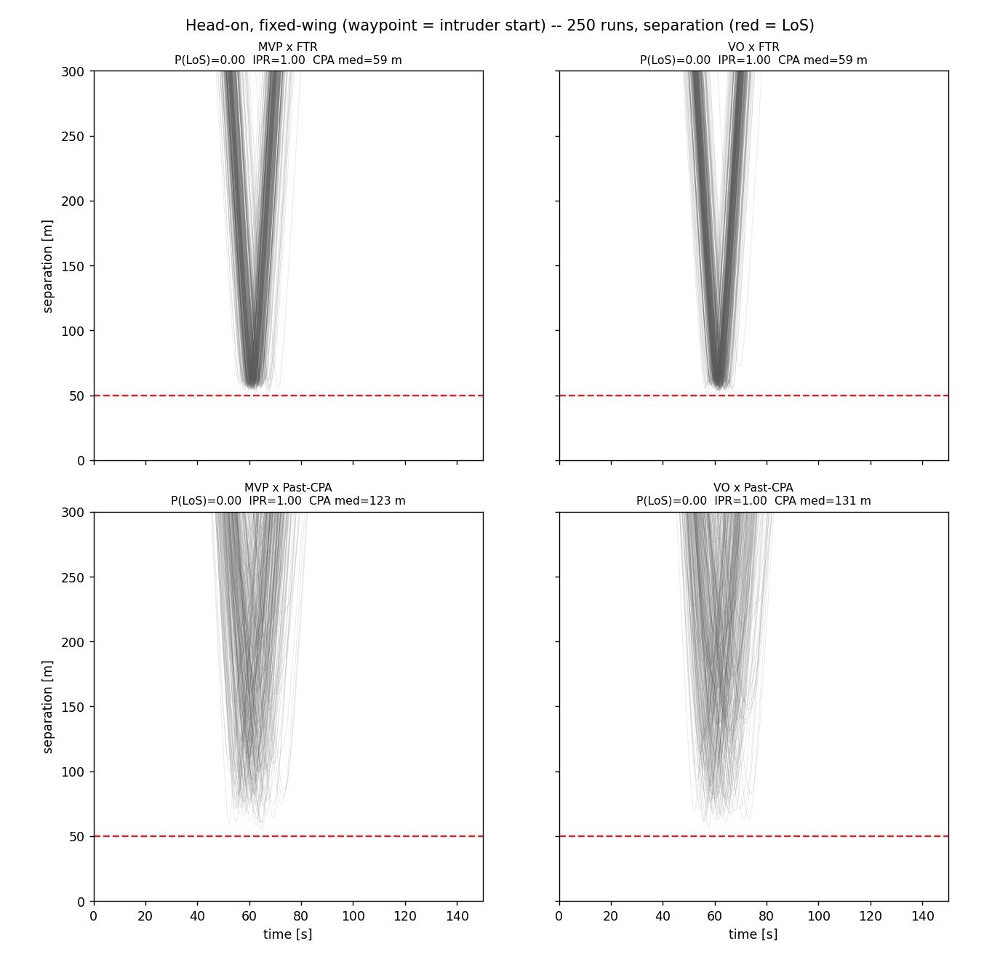
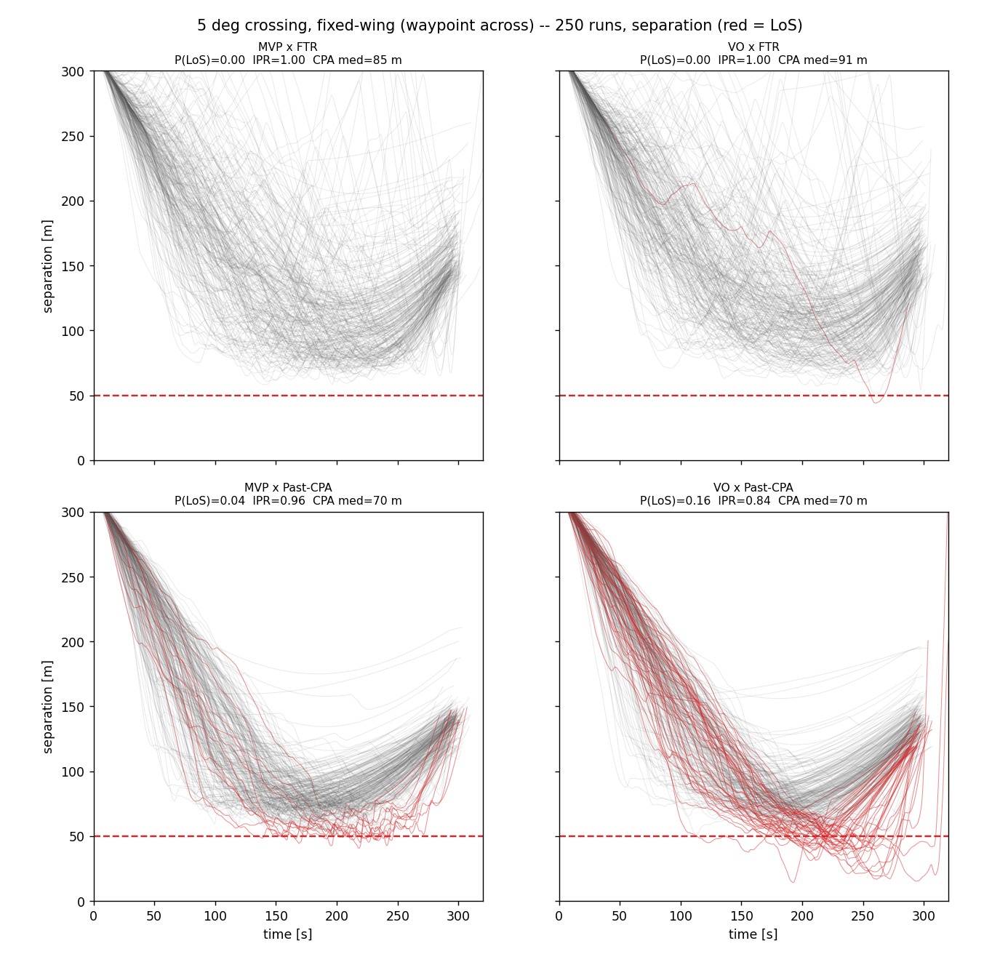

# Pairwise conflict

The pairwise environment is the two-aircraft building block everything else scales from. Place two aircraft on a collision course, give each a mission to fly, run the encounter to termination through the full stack, and measure whether separation held. It is **directed** (each aircraft decides from its own perceived picture) and **cooperative** (both maneuver, neither is a scripted obstacle), so a pairwise run already exercises the whole loop: [detection](../modules/separation/conflict-detection.md), [resolution](../modules/separation/conflict-resolution.md), [recovery](../modules/separation/recovery-criteria.md), the [CNS](../modules/cns/index.md) layer that decides what each aircraft knows, and the [autopilot](../modules/autopilot.md) that flies the mission and returns to it afterward.

## What it measures

The outcome is always read on the **true** states, whatever the aircraft perceived. Two numbers come out of a batch of conflict encounters. The **loss-of-separation probability** is the fraction that breached the protected zone, and the **intrusion prevention rate** is its complement:

$$ P(\text{LoS}) = \frac{n_\text{LoS}}{n}, \qquad \text{IPR} = 1 - P(\text{LoS}) $$

The other output is the **CPA distribution**: the closest approach (minimum separation) reached on each run. IPR is a single pass/fail summary; the CPA distribution shows the whole safety margin, including how much room the maneuver leaves and how heavy its tail is. A resolver that clears every run but only ever by a metre is not the same as one that clears comfortably, and only the distribution tells them apart.

With a perfect, noise-free stack a single fixed geometry gives a single deterministic answer. What makes it a distribution is the [CNS](../modules/cns/index.md) noise: each run draws its own GNSS error, its own dropped and delayed messages, and its own broadcast timing, so the fixed conflict plays out a little differently every time. The environment is therefore a **Monte Carlo over the CNS noise on one geometry**, and the spread in the plots below is that noise working through the resolution.

## The setup

A conflict is built with [`create_conflict`](https://github.com/fazlurnu/OpenCDaRR/blob/main/opencdarr/scenario.py), which places an intruder at a chosen crossing angle so the pair reaches a chosen miss distance a chosen time from now (here always `dcpa = 0`, the worst-case head-to-head). Each aircraft is then given a [waypoint mission](../modules/autopilot.md), so after avoiding it navigates back onto its route rather than drifting off on the avoidance heading.

Both aircraft are **fixed-wings** (cruise 17 m/s, protected zone 50 m). That matters for the outcome: a fixed-wing cannot stop or sidestep, so it banks and arcs to build lateral separation rather than translating instantly, and the resolvers' velocity commands are projected onto its course and airspeed channels by [`project_to_fixedwing`](https://github.com/fazlurnu/OpenCDaRR/blob/main/opencdarr/separation.py). Each aircraft flies **through** its waypoint (a pass-by, not a loiter), and the run ends when both have passed theirs, capped at 600 s.

The CNS stack is the realistic one, identical for both aircraft:

- **Navigation:** GNSS with 95% radial accuracy of **10 m** (position) and **1 m/s** (velocity).
- **Communication:** **0.95** reception probability per directed link, with a **lognormal latency** on each delivered message.
- **Broadcast timing:** a 1 Hz cadence with per-transmission **jitter**, so the two aircraft's updates drift out of lockstep the way real ADS-B slots do.

The resolvers run with a 1.05 margin, clearing to about 52.5 m rather than just to the zone edge.

## Two scenarios

Below are two geometries, each run 250 times across the full 2x2 of resolver (columns, [MVP](../modules/separation/conflict-resolution.md) / [VO](../modules/separation/conflict-resolution.md)) and recovery criterion (rows, [FTR](../modules/separation/recovery-criteria.md) / [Past-CPA](../modules/separation/recovery-criteria.md)).

### Head-on

Each aircraft's waypoint is the *other's* starting position, so they fly straight at each other and swap ends. This is the fast, unambiguous conflict: a strong closing speed and a clear side to turn to.

<figure markdown="span">
  
  <figcaption>Head-on ground tracks, 250 runs per cell (blue = own, orange = intruder; east exaggerated). <strong>FTR</strong> (top) reverts as soon as reverting is safe, so the tracks stay tight to the swap line. <strong>Past-CPA</strong> (bottom) holds the avoidance until the pair is diverging and fans out to a much wider berth. Each aircraft flies straight through its waypoint (a pass-by), rather than loitering it.</figcaption>
</figure>

<figure markdown="span">
  
  <figcaption>Head-on separation over time (red = a run that lost separation). <strong>FTR</strong> reverts right at the margin yet clears every run (no LoS), because it tests reverting to its <em>live</em> mission command back onto the route, not a velocity frozen at launch. <strong>Past-CPA</strong> over-holds to a median miss of ~130 m, well beyond the protected zone: safe, but a large and unnecessary detour.</figcaption>
</figure>

### 5 degree crossing

A near-parallel crossing, the two aircraft closing at barely 1.5 m/s and each bound for a waypoint far across the crossing. This is the hard case, and it is harder still for a fixed-wing: the closing is slow, the "am I diverging yet?" signal is weak and noise-sensitive, and the airframe can only build lateral separation slowly, through a banked turn.

<figure markdown="span">
  
  <figcaption>5 degree crossing ground tracks, 250 runs per cell (east exaggerated; the detour is metres against a kilometres-long leg). The pair starts nearly together, crosses, and separates to two distinct waypoints, so what the plots measure is the crossing itself, not a pile-up at the destination.</figcaption>
</figure>

<figure markdown="span">
  
  <figcaption>5 degree crossing separation over time (red = LoS). <strong>FTR</strong> (top) stays clear at nearly every run (MVP 0, VO 1 of 250). <strong>Past-CPA</strong> (bottom) under-clears at this angle, and <strong>VO x Past-CPA</strong> is the danger zone: 41 of 250 runs lose separation, one down to ~14 m. Separation climbs back at the end as each aircraft flies on toward its own waypoint.</figcaption>
</figure>

## What the runs show

- **The recovery criterion drives the CPA distribution, and its effect flips with the crossing angle.** Head-on, Past-CPA over-holds to a large miss (median ~130 m) while FTR reverts tight to the margin (~59 m). Near-parallel, it reverses: FTR clears wider (~85 to 91 m) and Past-CPA under-clears (~70 m). The resolver (MVP vs VO) barely moves IPR by comparison.
- **The near-parallel corner with Past-CPA is the one danger zone.** VO x Past-CPA at the 5 degree crossing loses separation in **41 of 250** runs (IPR 0.836), and MVP x Past-CPA in 11 (IPR 0.956); the two FTR cells clear at 1.000 and 0.996. Waiting until the pair is visibly diverging is a fragile thing to do when the divergence signal is weak, buried in noise, and the airframe answers it slowly.
- **FTR clears the head-on cleanly** (0 of 250, both resolvers) and tightly (~59 m median), because its revert-check tests the velocity the aircraft will actually resume: the *live* mission command back onto the route, not the launch velocity frozen at t = 0. Checking a velocity the aircraft would not really fly is what let a few margin-grazing runs slip under before.
- **A high IPR is not the whole story.** Head-on FTR and Past-CPA both clear 100% of runs, but one holds a ~59 m median miss and the other a ~130 m one. Only the CPA distribution, not the pass/fail rate, distinguishes a tight clearance from a wasteful one.

These are 250-run estimates, so the small rates carry real uncertainty (41 of 250 is 0.16 with roughly a plus-or-minus-0.05 interval); the qualitative picture is stable, the last digit is not.

## In the code

A single encounter is [`run_encounter`](https://github.com/fazlurnu/OpenCDaRR/blob/main/opencdarr/loop.py), which threads the autopilots, the CNS models, and the separation stack, runs to termination, and reports the outcome (`conflict`, `los`, `min_sep`) measured on the true states. The plain Monte Carlo estimator [`estimate_ipr`](https://github.com/fazlurnu/OpenCDaRR/blob/main/opencdarr/estimator.py) wraps it over many sampled encounters and aggregates the IPR; the study on this page instead fixes the geometry and sweeps only the CNS noise, recording the tracks and separation for the plots.

The figures are produced by [`scripts/handbook/mc_plot.py`](https://github.com/fazlurnu/OpenCDaRR/blob/main/scripts/handbook/mc_plot.py) (the Monte-Carlo engine is [`scripts/handbook/mc_pairwise.py`](https://github.com/fazlurnu/OpenCDaRR/blob/main/scripts/handbook/mc_pairwise.py)); results are cached, so a re-run replots without re-simulating:

```
PYTHONPATH=. python scripts/handbook/mc_plot.py        # 250 runs per cell, writes the four figures
PYTHONPATH=. python scripts/handbook/mc_pairwise.py    # the timing + P(LoS)/CPA table only
```

The same directed, cooperative core scales to more than two aircraft in the [multi-aircraft](multi-aircraft.md) environment, where resolutions start to interact.
