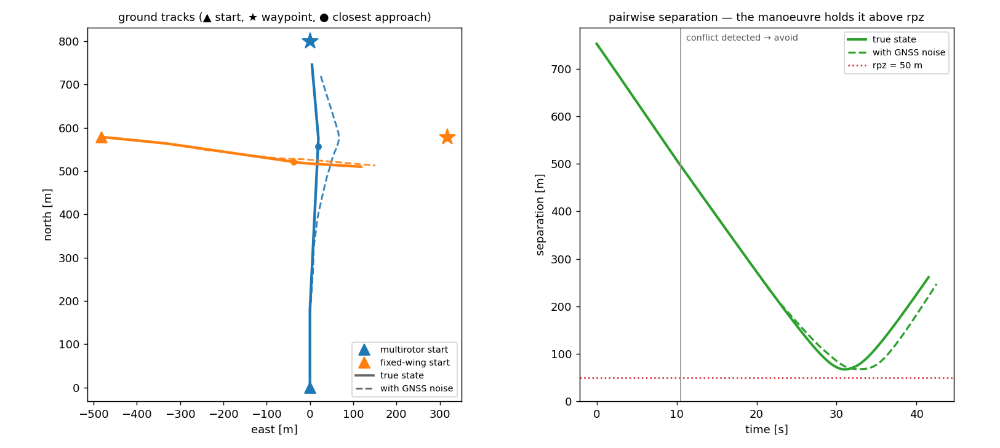
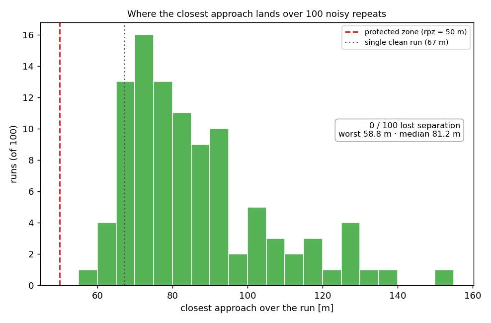

# A first run

The [previous page](how-it-works.md) took one step apart. This one runs a whole encounter, so you can see the pieces working together before meeting them one at a time under **Modules**.

The scenario is the smallest one that still has something to resolve: **two aircraft, each flying to a waypoint, whose straight legs happen to cross.** They are a mixed pair — a multirotor and a fixed-wing — so the same conflict is resolved by two different airframes. They spawn comfortably apart; a few seconds in, each predicts a loss of separation against the other and turns off its plan to avoid; once past, both recover and carry on to their waypoint.

## Setting up the encounter

Each aircraft is an [`Agent`](https://github.com/fazlurnu/OpenCDaRR/blob/main/opencdarr/fleet.py): a start state, an airframe (its [`Dynamics`](modules/dynamics/index.md) + [`Performance`](build-your-own/performance.md)), and an [`Autopilot`](modules/autopilot.md) to fly the mission. We give each a one-waypoint `goto` far down its initial track, so the nominal path runs straight through the crossing.

Rather than hand-place the second aircraft, we let [`create_conflict`](https://github.com/fazlurnu/OpenCDaRR/blob/main/opencdarr/scenario.py) do it: it returns an intruder whose straight leg loses separation with the ownship a chosen number of seconds from now. We ask for a crossing 30 s out — later than the 20 s look-ahead — so nothing is flagged at spawn and the conflict only appears once it drifts inside the horizon.

```python
from opencdarr.dynamics import FixedWing, Multirotor
from opencdarr.fleet import Agent
from opencdarr.mission import Mission
from opencdarr.autopilot import WaypointAutopilot
from opencdarr.performance import M600, SMALL_FIXEDWING
from opencdarr.scenario import create_conflict
from opencdarr.state import AircraftState
from opencdarr import geo

# the multirotor cruises north; create_conflict places the fixed-wing so their
# legs lose separation 30 s from now (crossing at 90 degrees)
copter = AircraftState(id="COPTER", lat=52.0, lon=4.0, trk=0.0, gs=18.0, yaw=0.0)
plane = create_conflict(copter, intr_id="PLANE", dpsi=90.0, dcpa=0.0,
                        tlos=30.0, rpz=50.0, gs_intr=15.0, side=1)

# each aircraft's waypoint sits 800 m straight down its own track
wp_copter = geo.forward(copter.lat, copter.lon, copter.trk, 800.0)
wp_plane = geo.forward(plane.lat, plane.lon, plane.trk, 800.0)

# the fixed-wing flies its cruise_airspeed; match it to the speed create_conflict
# assumed for the intruder (18 m/s is the multirotor's own cruise, so it needs nothing)
agents = [
    Agent(copter, M600, Multirotor(), WaypointAutopilot(Mission(goto=wp_copter))),
    Agent(plane, SMALL_FIXEDWING, FixedWing(),
          WaypointAutopilot(Mission(goto=wp_plane), cruise_airspeed=15.0)),
]
```

## Running it

Most of the times, when we are sure about our algorithms, we want to get the performance of our code straight away. We can use [`run_fleet`](https://github.com/fazlurnu/OpenCDaRR/blob/main/opencdarr/fleet.py) to advance the whole fleet to termination. It takes the separation stack — a [detector](modules/conflict-detection.md), a [resolver](modules/conflict-resolution.md), and a [recovery criterion](modules/recovery-criteria.md) — and every aircraft runs its own detect → resolve → recover against the others. Each airframe flies the *same* resolver command its own way: the multirotor takes the avoidance velocity directly, the fixed-wing turns onto it under a bank limit.

```python
from opencdarr.fleet import run_fleet
from opencdarr.cd import StateBased
from opencdarr.cr import MVP
from opencdarr.crr import PastCPA

outcome = run_fleet(
    agents, rpz=50.0, t_lookahead=20.0, dt=0.5,
    detector=StateBased(), resolver=MVP(margin=1.1),
    recovery=PastCPA(bouncing_guard=True),
)
print(outcome.min_sep)  # 67.2 m — above the 50 m protected zone, so both stay clear
```

So far every aircraft has acted on the *truth*: it knows its own position exactly and sees the other's exactly. That is the clean baseline. To make it realistic we turn on GNSS self-noise — each aircraft now measures its own state with an error before acting and broadcasting. That is **one argument**, [`navigation`](modules/cns/navigation.md), plus the random stream it draws from:

```python
from dataclasses import replace
from opencdarr.cns.navigation import GnssNavigation
from opencdarr import rng

# the noise magnitude rides on each aircraft's state (95% accuracy, in metres / m/s)
noisy = [replace(a, state=replace(a.state, pos_ci95=15.0, vel_ci95=1.5)) for a in agents]

outcome = run_fleet(
    noisy, rpz=50.0, t_lookahead=20.0, dt=0.5,
    detector=StateBased(), resolver=MVP(margin=1.1),
    recovery=PastCPA(bouncing_guard=True),
    navigation=GnssNavigation(), rng=rng.generator(rng.root_seed_sequence(20260725)),
)
print(outcome.min_sep)  # 67.8 m — a slightly different path, still clear
```

Everything else is identical. The whole difference between an idealised run and a noisy one is which state each aircraft gets to act on.

## What it looks like

`run_fleet` reports only the final numbers. To watch the encounter unfold we record the *same* run step by step: [`run_fleet_traced`](https://github.com/fazlurnu/OpenCDaRR/blob/main/scripts/handbook/tools/fleet_trace.py) — a small handbook helper — steps the identical loop and keeps the ground track and separation at every tick.

```python
from scripts.handbook.tools.fleet_trace import run_fleet_traced

trace = run_fleet_traced(
    agents, rpz=50.0, t_lookahead=20.0, dt=0.5,
    detector=StateBased(), resolver=MVP(margin=1.1),
    recovery=PastCPA(bouncing_guard=True),
)
trace.tracks      # each aircraft's (east, north) at every tick
trace.min_sep     # separation between them at every tick
trace.worst_sep   # the closest approach — equal to run_fleet's outcome.min_sep
```

Running that once for the clean fleet and once for the noisy one, then drawing the two together, gives the figure below.

<figure markdown="span">
  
  <figcaption>The same encounter run on the true state (solid) and with GNSS self-noise (dashed). Left: the ground tracks — the multirotor bulges east and the fixed-wing dips as each avoids, then both continue to their waypoint. Right: the separation between them. It falls as they close, the conflict is detected around 10 s, and the manoeuvre arrests it at ~67 m, above the 50 m protected zone.</figcaption>
</figure>

Two things are worth noticing. The separation never touches the protected zone: detection fires with enough look-ahead that the turn starts early and the closest approach is held well clear. And noise moves the result — with imperfect self-knowledge the two act on slightly wrong positions, so the tracks and the closest approach differ from the clean run. Here it stays safe; the point of the CNS layer is that it need not.

## One run is a sample

That noisy run cleared at 67.8 m — but a *different* random seed draws a different error at every step, so it is one sample of a random outcome. The safety metric is the **aggregate** over many independent runs: how often separation is lost, and how the margin to the protected zone is really distributed. This is a Monte Carlo, and the [reproducible-RNG discipline](modules/cns/navigation.md) makes it a one-liner, one independent substream per run, all spawned from a single root seed, so the whole batch is fixed by that seed alone.

```python
from opencdarr import rng

# 100 independent noisy repeats of the same encounter — one RNG substream each
outcomes = [
    run_fleet(
        noisy, rpz=50.0, t_lookahead=20.0, dt=0.5,
        detector=StateBased(), resolver=MVP(margin=1.1),
        recovery=PastCPA(bouncing_guard=True),
        navigation=GnssNavigation(), rng=rng.generator(stream),
    )
    for stream in rng.spawn(rng.root_seed_sequence(20260725), 100)
]

lost = sum(o.los for o in outcomes)              # runs that entered the protected zone
worst = min(o.min_sep for o in outcomes)         # the closest approach across all 100
print(f"{lost}/100 lost separation; worst {worst:.1f} m")  # 0/100 lost separation; worst 58.8 m
```

<figure markdown="span" style="max-width: 30rem; margin-inline: auto;">
  
  <figcaption>The closest approach reached in each of 100 noisy repeats of the same encounter. None cross the protected zone, but the outcome is spread from 59 m to 150 m (median 81 m). The single clean run (67 m) sits near the low end — one run tells you neither the typical margin nor the worst.</figcaption>
</figure>

None of the hundred lost separation, so for this geometry, this CDaRR algorithms, and this noise the design is robust. However, estimating a loss rate so small that a plain Monte Carlo would never sample it. That is what the [rare-event machinery](index.md) in the introduction is for (WiP).

This is still a single pairwise conflict, run once or a hundred times. The [Environments](environments/pairwise.md) section runs it at scale — sweeping the geometry, and then many aircraft at once — and each swappable piece used above has its own page under [Modules](modules/index.md).

!!! note "Run it yourself"
    Every snippet on this page — the build, both runs, the plot, and the 100-run Monte Carlo — is [`scripts/handbook/first_run.py`](https://github.com/fazlurnu/OpenCDaRR/blob/main/scripts/handbook/first_run.py): `PYTHONPATH=. python scripts/handbook/first_run.py`. The `run_fleet_traced` helper mirrors `run_fleet` exactly — its closest approach matches to the metre — so the recorded picture is the same run those numbers came from.
