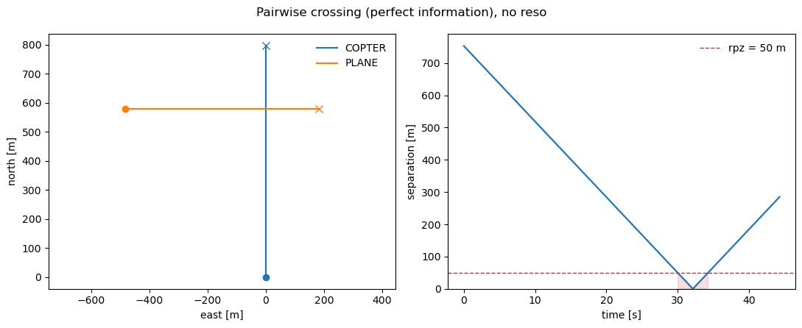
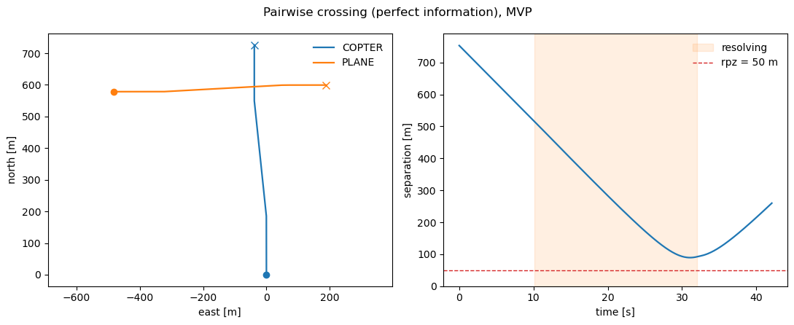
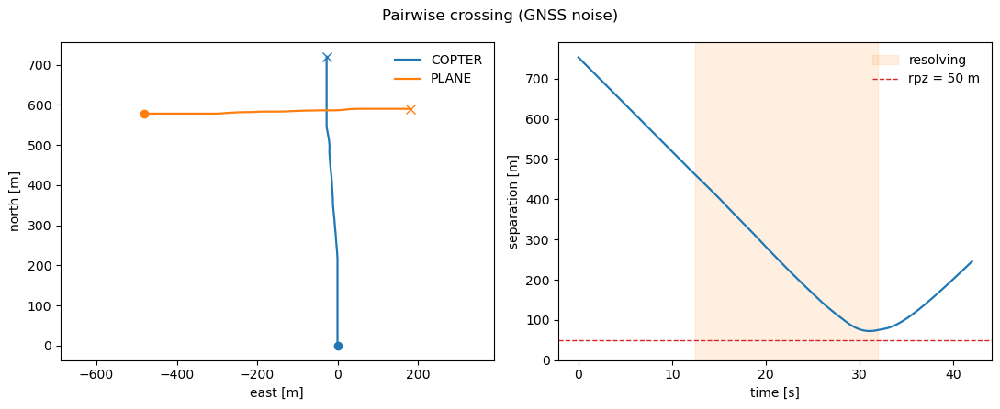
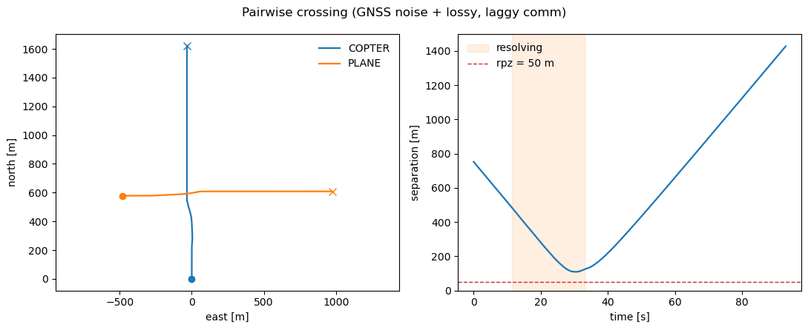
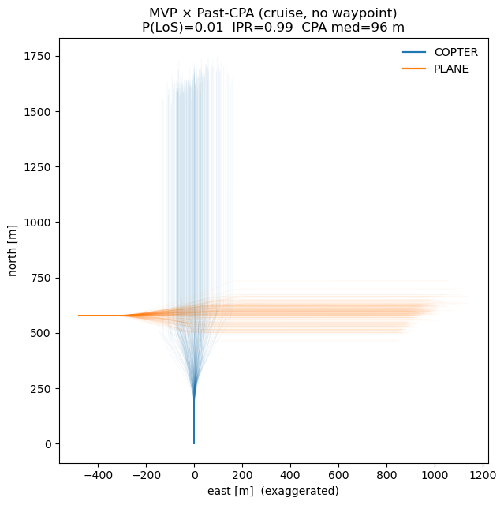
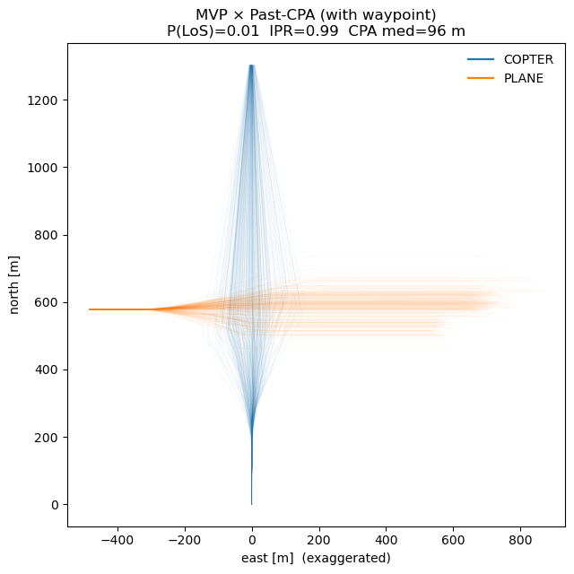
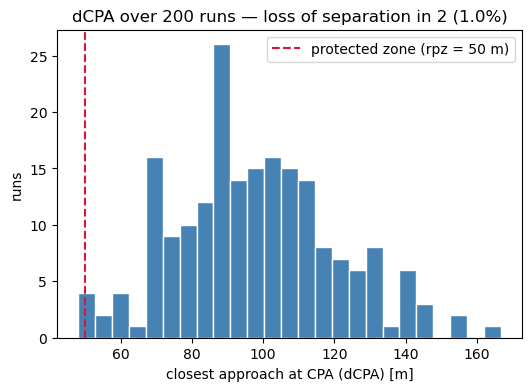
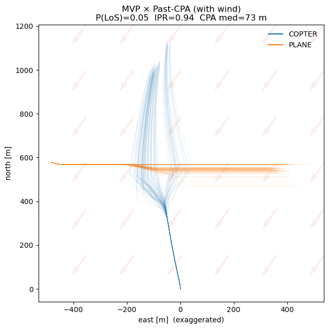
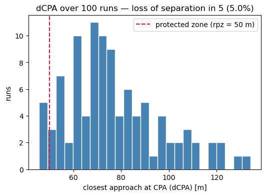

# A first run

The [previous page](how-it-works.md) took one simulation step apart. This one runs whole encounters, assembled entirely from the built-in models. We put two aircraft on a collision course, turn a resolver on, layer on sensing and communication uncertainty, and finish by repeating the encounter hundreds of times to read a safety rate off the aggregate.

The scenario stays fixed throughout — a multirotor climbing north and a fixed-wing crossing its path, spawned directly in conflict — so every change is attributable to the one piece we swap. Every piece here is a value or a single-method object handed to one function; [Build your own](build-your-own/index.md) later replaces any of them with code of your own, without touching the loop.

## Two aircraft from the built-in models

Each aircraft is an [`Agent`](https://github.com/fazlurnu/OpenCDaRR/blob/main/opencdarr/fleet.py): a start state, an airframe (a [`Dynamics`](modules/dynamics/index.md) + a [`Performance`](build-your-own/performance.md) envelope), and an [`Autopilot`](modules/autopilot.md). The ownship is a multirotor cruising north, flown by the built-in `M600` envelope and `Multirotor` model; the intruder is a fixed-wing on the built-in `SMALL_FIXEDWING` envelope and `FixedWing` model. A [`CruiseAutopilot`](modules/autopilot.md) holds each aircraft's track and speed whenever it is not avoiding.

```python
from opencdarr.dynamics import FixedWing, Multirotor
from opencdarr.fleet import Agent, run_fleet
from opencdarr.performance import M600, SMALL_FIXEDWING
from opencdarr.autopilot import CruiseAutopilot
from opencdarr.scenario import create_conflict
from opencdarr.state import AircraftState

# ownship: a multirotor cruising north on the built-in M600 envelope
copter = AircraftState(id="COPTER", lat=52.0, lon=4.0, trk=0.0, gs=18.0, yaw=0.0)
agent_copter = Agent(copter, M600, Multirotor(), CruiseAutopilot(copter.trk, copter.gs))
```

Rather than hand-place the intruder, [`create_conflict`](https://github.com/fazlurnu/OpenCDaRR/blob/main/opencdarr/scenario.py) returns one whose straight leg loses separation with the ownship a chosen number of seconds from now — here a 90° crossing, 30 s out, later than the 20 s look-ahead so nothing is flagged at spawn. Both airframes are built-in, so the intruder is a `FixedWing` on the `SMALL_FIXEDWING` envelope.

```python
plane = create_conflict(copter, intr_id="PLANE", dpsi=90.0, dcpa=0.0,
                        tlos=30.0, rpz=50.0, gs_intr=15.0, side=1)
agent_plane = Agent(plane, SMALL_FIXEDWING, FixedWing(), CruiseAutopilot(plane.trk, plane.gs))

agents = [agent_copter, agent_plane]   # the framework is agent-based: collect them into a fleet
```

## The first run — no resolution

[`run_fleet`](https://github.com/fazlurnu/OpenCDaRR/blob/main/opencdarr/fleet.py) advances the whole fleet to termination. With no resolver, both aircraft simply fly their plans into each other — the baseline that shows the conflict is real.

```python
from opencdarr.cd import StateBased
from opencdarr.viz import plot_pairwise

run = run_fleet(
    agents, rpz=50.0, t_lookahead=20.0, dt=0.1,
    detector=StateBased(), resolver=None, recovery=None,
    done_timeout=10.0, record=True,
)
print(run.min_sep, run.los)   # 0.8 m  True  — they collide
fig = plot_pairwise(run, rpz=50.0, title="Pairwise crossing (perfect information), no reso")
```

<figure markdown="span">
  
  <figcaption>No resolver: the legs cross and separation collapses to 0.8 m, deep inside the 50 m protected zone.</figcaption>
</figure>

## Adding a resolver

The separation stack is three swappable pieces — a [detector](modules/separation/conflict-detection.md), a [resolver](modules/separation/conflict-resolution.md), and a [recovery criterion](modules/separation/recovery-criteria.md). Adding a built-in `MVP` resolver and a `PastCPA` recovery — the only two arguments that change — is enough to clear the crossing. A `VO` resolver drops into the same slot if you would rather try that instead.

```python
from opencdarr.cr import MVP
from opencdarr.crr import PastCPA

run = run_fleet(
    agents, rpz=50.0, t_lookahead=20.0, dt=0.1,
    detector=StateBased(), resolver=MVP(), recovery=PastCPA(bouncing_guard=True),
    done_timeout=10.0, record=True,
)
print(run.min_sep, run.los)   # 89.3 m  False  — clear
```

<figure markdown="span">
  
  <figcaption>With `MVP` and `PastCPA`, the copter turns off its plan in time and the closest approach holds at 89.3 m.</figcaption>
</figure>

## Sensing uncertainty

So far every aircraft has acted on the truth. To make it realistic we turn on GNSS self-noise: each aircraft measures its own state with an error before acting and broadcasting. That is one argument — [`navigation`](modules/cns/navigation.md) — plus the noise magnitude on each state and a seeded random stream.

```python
from dataclasses import replace
from opencdarr.cns.navigation import GnssNavigation
from opencdarr import rng

noisy_agents = [replace(a, state=replace(a.state, pos_ci95=15.0, vel_ci95=1.5)) for a in agents]

noisy_run = run_fleet(
    noisy_agents, rpz=50.0, t_lookahead=20.0, dt=0.5,
    detector=StateBased(), resolver=MVP(), recovery=PastCPA(bouncing_guard=True),
    navigation=GnssNavigation(), rng=rng.generator(rng.root_seed_sequence(42)),
    stop_within=100.0, done_timeout=10.0, record=True,
)
print(noisy_run.min_sep, noisy_run.los)   # 72.3 m  False
```

<figure markdown="span">
  
  <figcaption>With a 15 m / 1.5 m·s⁻¹ GNSS error each aircraft acts on a slightly wrong self-fix, so the path differs — here it clears at 72.3 m.</figcaption>
</figure>

## Communication uncertainty

Communication uncertainty layers on the same way. A directed [`Comm`](modules/cns/communication.md) model gives each transmission direction its own reception probability — `COPTER→PLANE` is more reliable than the reverse — over a lognormal latency, on its own reproducible stream.

```python
from opencdarr.cns import Comm, lognormal_latency

nav_seq, comm_seq = rng.spawn(rng.root_seed_sequence(42), 2)   # independent nav / comm streams

comm = Comm(
    reception_prob={("COPTER", "PLANE"): 0.9, ("PLANE", "COPTER"): 0.6},   # directed, asymmetric
    latency=lognormal_latency(median=0.5, sigma=0.4),                      # seconds
)

# the same run, now also given a slightly wider resolver buffer and the comm model
noisy_run = run_fleet(
    noisy_agents, rpz=50.0, t_lookahead=20.0, dt=0.5,
    detector=StateBased(), resolver=MVP(margin=1.1), recovery=PastCPA(bouncing_guard=True),
    navigation=GnssNavigation(), rng=rng.generator(nav_seq),
    communication=comm,          comm_rng=rng.generator(comm_seq),
    stop_within=100.0, done_timeout=60.0, record=True,
)
print(noisy_run.min_sep, noisy_run.los)   # 109.6 m  False
```

<figure markdown="span">
  
  <figcaption>Dropped and delayed broadcasts change which fixes each aircraft acts on. With the slightly wider `MVP(margin=1.1)` buffer this seed clears at 109.6 m — but a single seed proves little either way, which is the cue for a Monte Carlo.</figcaption>
</figure>

## One run is a sample — a Monte Carlo

That noisy run cleared, but a different seed draws different errors, so it is one sample of a random outcome. The safety metric is the aggregate over many independent repeats — one substream per run, all spawned from a single root seed, so the whole batch is fixed by that seed alone and each run draws independent navigation *and* communication noise.

```python
n_runs = 200
outcomes = [
    run_fleet(
        noisy_agents, rpz=50.0, t_lookahead=20.0, dt=0.2,
        detector=StateBased(), resolver=MVP(), recovery=PastCPA(bouncing_guard=True),
        navigation=GnssNavigation(), rng=rng.generator(nav_seq),
        communication=comm,          comm_rng=rng.generator(comm_seq),
        stop_within=100.0, done_timeout=60.0, record=True,
    )
    for nav_seq, comm_seq in (rng.spawn(sub, 2) for sub in rng.spawn(rng.root_seed_sequence(42), n_runs))
]

lost = sum(o.los for o in outcomes)
min_seps = [o.min_sep for o in outcomes]
print(f"{lost}/{n_runs} lost separation; dCPA min {min(min_seps):.1f} m, "
      f"median {sorted(min_seps)[n_runs // 2]:.1f} m")   # 2/200 lost; min 48.1 m, median 96.3 m
```

Two views of the same sweep: [`plot_pairwise_montecarlo`](https://github.com/fazlurnu/OpenCDaRR/blob/main/opencdarr/viz.py) overlays every run's ground tracks, and a histogram of the closest approaches shows the margin distribution.

<figure markdown="span">
  
  <figcaption>200 noisy repeats of the crossing (cruise, no waypoint). The dense core is where the fleet usually goes; the faint threads are the noise tails.</figcaption>
</figure>

<figure markdown="span" style="max-width: 32rem; margin-inline: auto;">
  
  <figcaption>The closest approach (dCPA) over the 200 runs: two dip just inside the protected zone (min 48.1 m, a ~1% rate), the rest spread up to the high nineties (median 96.3 m).</figcaption>
</figure>

## Waypoint mission

Give the copter a bounded mission — a waypoint 75 s of cruise ahead — instead of an open-ended cruise, and repeat the sweep. Only the ownship's autopilot changes.

```python
from opencdarr.autopilot import WaypointAutopilot
from opencdarr.mission import Mission
from opencdarr import geo

wp_copter = geo.forward(copter.lat, copter.lon, copter.trk, copter.gs * 75.0)
agent_copter = Agent(copter, M600, Multirotor(), WaypointAutopilot(Mission(goto=wp_copter)))

agents = [agent_copter, agent_plane]
noisy_agents = [replace(a, state=replace(a.state, pos_ci95=15.0, vel_ci95=1.5)) for a in agents]
# ... the same 200-run sweep (stop_within=50)  ->  2/200 lost; dCPA min 48.1 m, median 96.3 m
```

<figure markdown="span">
  
  <figcaption>With a waypoint the copter's tracks pinch toward its goal, but the safety picture is unchanged — 2/200 lost, median 96.3 m.</figcaption>
</figure>

<figure markdown="span" style="max-width: 32rem; margin-inline: auto;">
  
  <figcaption>The dCPA distribution for the waypoint sweep — the same ~1% low tail as the cruise, median 96.3 m.</figcaption>
</figure>

## Wind

Finally, a constant wind. One line builds the field, one argument passes it in.

```python
from opencdarr.wind import WindField

wind = WindField.from_met(coming_from_deg=30.0, speed=10.0)   # constant 10 m/s from the NNE
# ... the same sweep, now with  wind=wind  in run_fleet and n_runs=100
#     ->  5/100 lost; dCPA min 45.7 m, median 73.7 m
```

Both airframes here are built-in and wind-aware, so both crab: the multirotor and the fixed-wing each fly a slightly displaced path, and the margin that resolution had bought erodes. The median closest approach falls from the mid-nineties to the low seventies, and the loss rate rises to about 5%.

<figure markdown="span">
  
  <figcaption>The same sweep in a 10 m/s wind from the north-northeast (faint arrows point downwind). Both aircraft crab, the margins tighten, and five of the 100 runs enter the protected zone.</figcaption>
</figure>

<figure markdown="span" style="max-width: 32rem; margin-inline: auto;">
  
  <figcaption>With wind the whole distribution shifts left, the low tail reaches 45.7 m, and a small mass falls left of the protected zone — the 5/100 losses (a ~5% rate).</figcaption>
</figure>

A hundred to two hundred runs are enough to *see* a rate of a few percent, but far too few to resolve the much smaller probabilities a real safety target asks for. Estimating those needs [rare-event simulation](rare-event/index.md).

Every piece assembled above — the airframes, the resolver, the CNS layers, the mission, the wind — is a value or a single-method object passed to `run_fleet`. [Build your own](build-your-own/index.md) shows how to replace any of them with code of your own; [Modules](modules/index.md) documents the built-ins; the [Environments](environments/pairwise.md) section runs this same conflict at scale.

!!! note "Run it yourself"
    Every step on this page is the notebook [`examples/handbook/a_first_run.ipynb`](https://github.com/fazlurnu/OpenCDaRR/blob/main/examples/handbook/a_first_run.ipynb), top to bottom — the build, each run, and all three Monte-Carlo sweeps.
