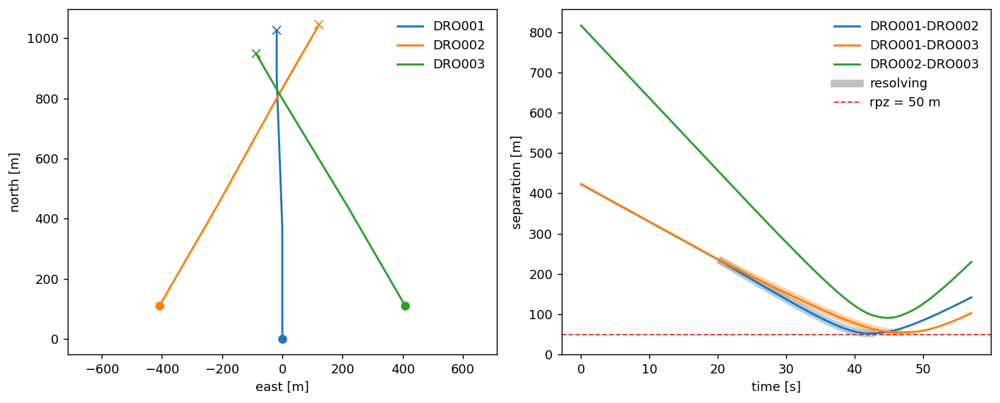

# A first run

Let's put two aircraft on a collision course, one multirotor flying north to a waypoint and one fixed-wing crossing eastward. We fly that encounter first with nothing switched on, then add a separation stack and watch it clear. Finally, we put three aircraft in conflict at the same time.

## Your first agent

Every aircraft starts from an [`AircraftState`](https://github.com/fazlurnu/OpenCDaRR/blob/main/opencdarr/state.py). The state carries the identity (`id`), the position (`lat`, `lon`), the direction of travel (`trk`), the ground speed (`gs`), and the direction the nose points (`yaw`).

```python
from opencdarr.state import AircraftState

copter_init_state = AircraftState(id="COPTER", lat=52.0, lon=4.0, trk=0.0, gs=18.0, yaw=0.0)
```

Then, because this simulator is agent-based, we wrap that state in an [`Agent`](https://github.com/fazlurnu/OpenCDaRR/blob/main/opencdarr/fleet.py). An agent is an `AircraftState`, a [`performance`](../handbook/aircraft/performance.md) envelope, a [`kinematics`](../handbook/aircraft/index.md) model, and an [`autopilot`](../handbook/aircraft/autopilot.md) that flies the mission. For this first one we want an `M600`, which is a `Multirotor`. Its mission is to reach a single waypoint, so we import `WaypointAutopilot` and `Mission`. We put that waypoint straight ahead on the current track, 75 s of cruise away, with `geo.forward`.

```python
from opencdarr.fleet import Agent
from opencdarr.kinematics import Multirotor
from opencdarr.performance import M600

from opencdarr import geo
from opencdarr.mission import Mission
from opencdarr.autopilot import WaypointAutopilot

wp_copter = geo.forward(copter_init_state.lat, copter_init_state.lon,
                        copter_init_state.trk, copter_init_state.gs * 75.0)
agent_copter = Agent(copter_init_state, M600, Multirotor(), WaypointAutopilot(Mission(goto=wp_copter)))
print(agent_copter)
```

```{ .text .output }
Agent COPTER
  state       52.00000, 4.00000 | trk 0 deg | gs 18 m/s | yaw 0 deg
  perf        v [-18, 18] m/s | ax 5 m/s2 | yaw rate 90 deg/s
  kinematics  Multirotor()
  autopilot   WaypointAutopilot(1 wp -> 52.01215, 4.00000)
```

## Your first intruder

In separation management we usually want a conflict to simulate. Rather than guessing where to put a second aircraft, we can use the [`create_conflict`](https://github.com/fazlurnu/OpenCDaRR/blob/main/opencdarr/scenario/pairwise.py) function to build the intruder's `AircraftState` for us. It is adapted from [`BlueSky`](https://github.com/TUDelft-CNS-ATM/bluesky). Here the intruder crosses at 90° (`dpsi`), misses by 0 m at the closest point of approach (`dcpa`), and enters the 50 m protected zone (`rpz`) 30 s from now (`tlos`), flying at 15 m/s (`gs_intr`).

This second aircraft is a `FixedWing`, so it has different kinematics from the multirotor. Its performance envelope is `SMALL_FIXEDWING`, and we want it to cruise, so we give it a `CruiseAutopilot` that holds its track and speed.

```python
from opencdarr.scenario import create_conflict
from opencdarr.kinematics import FixedWing
from opencdarr.performance import SMALL_FIXEDWING
from opencdarr.autopilot import CruiseAutopilot

# spawn the plane directly in conflict
plane_init_state = create_conflict(copter_init_state, intr_id="PLANE", dpsi=90.0, dcpa=0.0,
                        tlos=30.0, rpz=50.0, gs_intr=15.0, side=1)
agent_plane = Agent(plane_init_state, SMALL_FIXEDWING, FixedWing(), CruiseAutopilot(plane_init_state.trk, plane_init_state.gs))
agent_plane
```

```{ .text .output }
Agent PLANE
  state       52.00521, 3.99295 | trk 90 deg | gs 15 m/s
  perf        v [12, 25] m/s | ax 2 m/s2 | bank <= 44 deg at 60 deg/s
  kinematics  FixedWing()
  autopilot   CruiseAutopilot(heading=90, speed=15)
```

## Your first simulation, no separation management

We have created the agents that we want to simulate. For the simulation, we gather them into one list, `agents`, and pass it to [`run_fleet`](https://github.com/fazlurnu/OpenCDaRR/blob/main/opencdarr/fleet.py). There are a few input arguments to set. Here we use a 50 m radius of protected zone (`rpz`), a simulation timestep (`dt`) of 0.1 s, and we stop the simulation 10 s after the fleet has been continuously clear (`done_timeout`).

We pass no detector, so nothing is predicted and `conflict` stays `no`. The loss of separation (LoS) and the minimum separation are still measured on the true states, which is exactly the baseline we want here. Finally, `record=True` keeps the trajectory so that we can plot it.

```python
from opencdarr.fleet import run_fleet

agents = [agent_copter, agent_plane]

run = run_fleet(
    agents, rpz=50.0, dt=0.1,
    done_timeout=10.0,
    record=True,
)

print(run)
fig = run.plot(rpz=100)
```

```{ .text .output }
FleetOutcome
  conflict  no
  los       yes | 1 pair, 2 aircraft
  min_sep   0.01495 m | COPTER-PLANE
  ended     done_timeout (fleet stayed clear long enough)
  frames    StatesLog(444 frames, t=0.0→44.3s)
```

<figure markdown="span">
  
  <figcaption>No separation management — the legs cross and separation collapses to 0.01 m. The dashed line is drawn at 100 m here, wider than the 50 m the run is measured against.</figcaption>
</figure>

## With conflict resolution

Now, we are adding the conflict detection (CD), conflict resolution (CR), and recovery criterion (CRR). First a [detector](../handbook/separation/conflict-detection.md), returning a `bool` of whether a separation manoeuvre should start or not. Then a [resolver](../handbook/separation/conflict-resolution.md), telling the aircraft where to go with a `MotionCommand`. Finally a [recovery criterion](../handbook/separation/recovery-criteria.md), telling it when the manoeuvre can be disengaged. Here we use `StateBased` detection, the `MVP` resolver, and `PastCPA` recovery. Detection needs a horizon, so we also set the threshold of the lookahead time (`t_lookahead`) to 20 s. A `VO` resolver drops into the same slot in case you want a quick try.

This time we also let the copter finish its mission. The run ends once every waypoint-targeting aircraft is within 20 m of its waypoint (`stop_within`), and the `done_timeout` is set far out of the way at 1000 s.

```python
from opencdarr.cd import StateBased
from opencdarr.cr import MVP, VO
from opencdarr.crr import PastCPA

# we are running this sim with MVP, but you can also try with VO
run = run_fleet(
    agents, rpz=50.0, t_lookahead=20.0, dt=0.1,
    detector= StateBased(), resolver=MVP(),
    recovery= PastCPA(bouncing_guard=True),
    stop_within=20, done_timeout=1000.0,
    record=True,
)

print(run)
fig = run.plot(rpz=50)
```

```{ .text .output }
FleetOutcome
  conflict  yes
  los       no
  min_sep   89.35 m | COPTER-PLANE
  ended     stop_within (every waypoint-targeting aircraft arrived)
  frames    StatesLog(759 frames, t=0.0→75.8s)
```

<figure markdown="span">
  
  <figcaption>With <code>MVP</code> and <code>PastCPA</code> the pair clears at 89.35 m, and the run carries on until the copter reaches its waypoint at 75.8 s. The grey band marks the steps where an aircraft is resolving.</figcaption>
</figure>

## Multi-aircraft encounter

Finally, let's see what happens when more than two aircraft are in conflict at the same time, with state-based conflict detection, `MVP`, and `PastCPA` for the recovery. Two fixed-wing intruders cross the ownship's track at +30° and −30° (`dpsi`), both reaching the protected zone 40 s from now (`tlos`).

```python
RPZ = 50.0
TLOS = 40.0

own = AircraftState(id="DRO001", lat=52.0, lon=4.0, trk=0.0, gs=18.0)
agents = [Agent(own, SMALL_FIXEDWING, FixedWing(), CruiseAutopilot(own.trk, own.gs))]

# DRO002 crosses at +30 deg, DRO003 at -30 deg (dpsi, symmetric about the ownship's track)
intruder_specs = [("DRO002", 30.0), ("DRO003", 330.0)]
gs_intr = 18.0
dcpa_intr = 0.0

for intr_id, dpsi in intruder_specs:
    intr = create_conflict(
        own, intr_id=intr_id, dpsi=dpsi, dcpa=dcpa_intr, tlos=TLOS, rpz=RPZ,
        gs_intr=gs_intr, side=1,
    )
    agents.append(Agent(intr, SMALL_FIXEDWING, FixedWing(), CruiseAutopilot(intr.trk, intr.gs)))

run = run_fleet(
    agents, rpz=50.0, t_lookahead=20.0, dt=0.1,
    detector= StateBased(), resolver=MVP(),
    recovery= PastCPA(bouncing_guard=True),
    done_timeout=10.0,
    record=True,
)

print(run)
fig = run.plot(rpz=RPZ)
```

```{ .text .output }
FleetOutcome
  conflict  yes
  los       no
  min_sep   52.19 m | closest of 3 pairs
  pairs     DRO001-DRO002  52.19 m
            DRO001-DRO003  54.72 m
            DRO002-DRO003  90.8 m
  ended     done_timeout (fleet stayed clear long enough)
  frames    StatesLog(572 frames, t=0.0→57.1s)
```

<figure markdown="span">
  
  <figcaption>Three aircraft in conflict at once. The two crossing pairs bottom out at 52.19 m and 54.72 m, outside the 50 m protected zone.</figcaption>
</figure>

## Where to go next

Every piece assembled above, the airframes, the autopilot, and the three parts of the separation stack, is a value or a single-method object passed to `run_fleet`. The [Handbook](../handbook/index.md) explains each built-in and states the contract for replacing it, including the [CNS](../handbook/cns/index.md) layers and the [wind](../handbook/wind.md) that make a run less than perfect. One run is one sample of a random outcome, and [Estimators](../handbook/estimators/index.md) turns many runs into a rate.

!!! code "Run it yourself"
    Every step on this page is the notebook [`examples/tutorial/L0_a_first_run.ipynb`](https://github.com/fazlurnu/OpenCDaRR/blob/main/examples/tutorial/L0_a_first_run.ipynb), top to bottom, and the three figures are its own output.

That was the shape of an answer. The course that teaches you to build your own starts at [L0 · Setup](../tutorials/l0-setup.md) — about 12 hours of core lessons from here to a full experiment.
