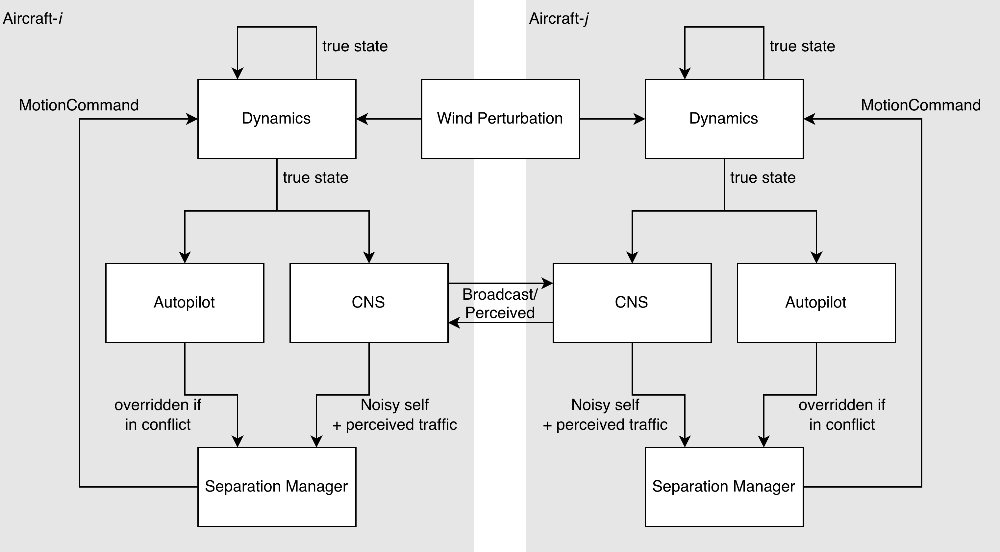

# How it works

This page describes the design principles, the parts it is built from, then a full step of the parts interaction.

## Design principles

**Realism.** Aircraft measure their own position with an error, broadcasts are missed and delayed, and wind pushes each airframe off its commanded track. Results then reflect how separation maintains safety against imperfect situational awareness. You can also add your own source of uncertainty.

**Modularity.** Every component listed in **[Modules](../handbook/index.md)** is an abstract base class with a single method to implement. Changing an experiment means changing an implementation. Comparing your conflict resolution algorithm is changing one input argument away.

**Support for rare-event simulation.** The aircraft state, the guidance progress, and the separation memory are values passed in and out of each step. Therefore, the full state of a run can be copied at any instant and continued independently. That is what a rare-event estimator (multi-level splitting, IPS) needs to clone a particle mid-flight and follow the rare branch toward a collision.

## An aircraft is an `Agent`

An `Agent` is everything that belongs to *one* aircraft. It is the object created to spawn an aircraft in a simulation and it is constructed from four items:

```python
Agent(state, perf, kinematics(), autopilot())
#     |      |     |             |
#     |      |     |             +-- what it is trying to do when no conflict
#     |      |     +---------------- how it moves
#     |      +---------------------- what it is capable of
#     +----------------------------- where it is right now
```

### The agent and the environment

An aircraft is an agent, where it is aware of its own states, performance, kinematics, and the mission. Then, they are spawned in an environment with specific interaction rules such as conflict detection, conflict resolution, and recovery criterion. The decision for managing separation is based on a noisy self-state and off-timed traffic perception. Wind interface is also available.

Flying a mixed aircraft type is possible. For instance, in an experiment you can spawn agents with a `Multirotor` kinematics as well as a `FixedWing` one. However, both will interact under that same interaction rules, all of them share the same CDaRR algorithm. Curious to see? Try [A first run](first-run.md).

## One simulation step

The figure below shows one step for a pair of aircraft, `i` and `j`, inside `run_fleet`. Every single module in the diagram can be replaced by your own implementation and they are just one function away. This is to support a common environment and metric towards a safer separation management for ATM/UTM.

<figure markdown="span">
  
  <figcaption>One step for a pair of aircraft. Every aircraft can only share information through a directed CNS channel.</figcaption>
</figure>

<div class="col-widths" markdown>

The table below summarises the interface and role of each of the modules. Note that in the diagram, the `ConflictDetector`, `ConflictResolver`, and `RecoveryCriterion` live under the `SeparationManager` block, while the `CommunicationModel`, `NavigationModel`, and `SurveillanceModel` live under the `CNS` block.

| Interface | Role |
| --- | --- |
| [`Kinematics`](../handbook/aircraft/index.md) | Integrate the equations of motion for one vehicle |
| [`NavigationModel`](../handbook/cns/navigation.md) | Measure an aircraft's own (noisy) state to broadcast |
| [`CommunicationModel`](../handbook/cns/communication.md) | Deliver or drop a broadcast, with latency |
| [`SurveillanceModel`](../handbook/cns/surveillance.md) | Hold the perceived state of a receiver |
| [`ConflictDetector`](../handbook/separation/conflict-detection.md) | Predict loss of separation within a look-ahead time |
| [`ConflictResolver`](../handbook/separation/conflict-resolution.md) | Compute the avoidance manoeuvre against a set of intruders |
| [`RecoveryCriterion`](../handbook/separation/recovery-criteria.md) | Decide when it is safe to disengage the separation algorithm |
| [`Autopilot`](../handbook/aircraft/autopilot.md) | Produce the nominal command that tracks the mission |
</div>

The [next page](first-run.md) simulates a pairwise encounter, two aircraft flying toward a conflict and avoiding it, and shows what the noise and wind can change.
