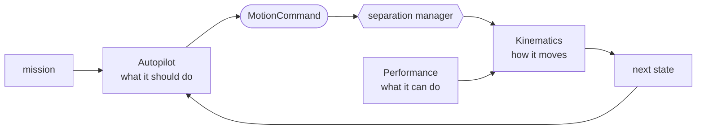

# Aircraft

An aircraft in this library is an `Agent`: a start state, an airframe, and an autopilot that flies the mission. The airframe is itself two values, a [`Kinematics`](kinematics/index.md) model and the [`Performance`](performance.md) envelope it is held inside. Nothing else about a vehicle is modelled. The three parts are swappable one at a time, so a new vehicle is usually a new envelope, and a new *kind* of vehicle is a new kinematics.

Each timestep runs the same loop. The autopilot reads the mission and proposes a command, the [separation manager](../separation/index.md) either passes that command through or replaces it with an avoidance command, and the kinematics integrates whichever command survives, inside the envelope.

- **[Performance](performance.md)**: the envelope, a plain value holding the speeds, accelerations, and turn limits of one airframe. It is an input to the model rather than a constant inside it, which is what makes a DJI M600 and an airliner the same code with different numbers.
- **[Kinematics](kinematics/index.md)**: the equations of motion, and the `MotionCommand` that drives them. Two airframes ship with the library, the [multirotor](kinematics/multirotor.md) and the [fixed-wing](kinematics/fixedwing.md), and both are point-mass models.
- **[Autopilot & mission](autopilot.md)**: what turns a mission into one command per timestep, either holding a cruise or navigating a list of waypoints for both airframes from one implementation.

The split matters for the separation stack. The autopilot says what the aircraft *wants*, the kinematics says what it is physically *able* to do, and the performance envelope is the bound between the two. A resolver that ignored the envelope would ask for a manoeuvre the aircraft cannot make.
