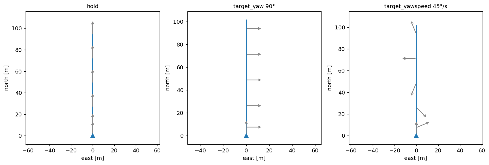
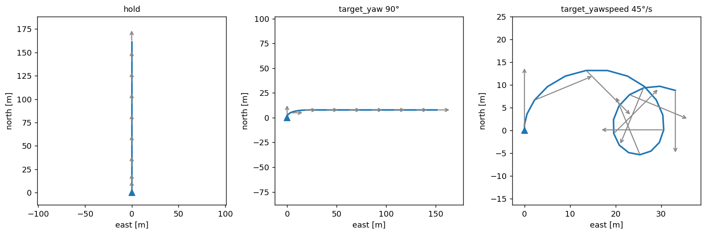
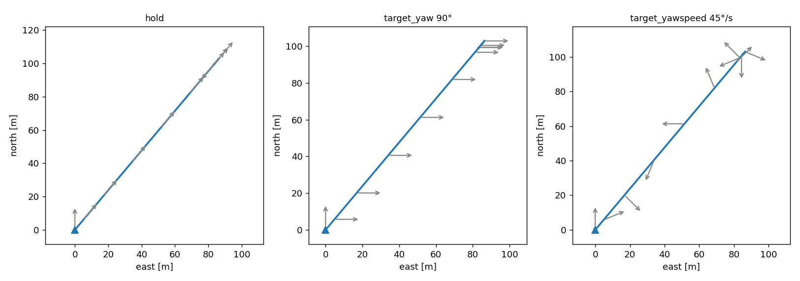
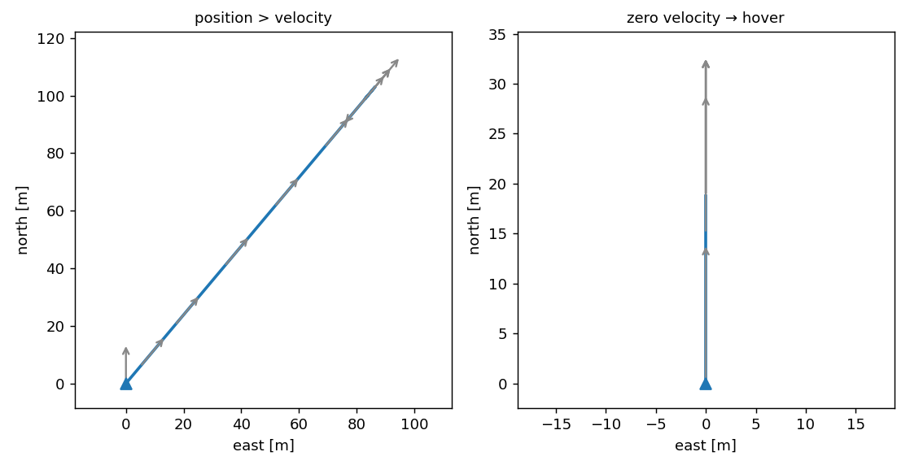

# Multirotor

The multirotor is a **holonomic point mass**. Its velocity can point in any direction and change direction in a single bounded step, and it can slow, stop, and hover. Facing is separate from travel, so the nose heading (`yaw`) can point one way while the vehicle moves another. This library uses the assumed DJI M600 envelope, with top speed `v_max` 18 m/s, isotropic acceleration `a_x` 5 m/s², and yaw rate 90 °/s. These limits are a [`Performance`](performance.md) value, not constants of the model, so a different multirotor is a different value.

## Equation of motion

Each step the model advances the ground velocity $\mathbf{v} = (v_E, v_N)$ and the position. The target ground velocity $\mathbf{v}_c$ is first read from the command and clamped to top speed.

$$ \mathbf{v}_t = \operatorname{clip}_{\lVert\cdot\rVert}\!\left(\mathbf{v}_c,\; v_{\max}\right) $$

Then the velocity moves straight toward that target, under the acceleration limit.

$$ \mathbf{v}' = \mathbf{v} + \operatorname{clip}_{\lVert\cdot\rVert}\!\left(\mathbf{v}_t - \mathbf{v},\; a_x\,\Delta t\right) $$

Here $\operatorname{clip}_{\lVert\cdot\rVert}(\mathbf{u}, m)$ scales a vector down to magnitude $m$ when it is longer and leaves it otherwise. Position then advances by a great-circle step of $\lVert\mathbf{v}'\rVert\,\Delta t$ along the new track. Because the bound is on the velocity *vector*, a right-angle change of direction is one bounded step rather than a turn-rate-limited arc, and a zero target brings the vehicle to a hover.

The nose heading is a separate channel. It turns toward a commanded `target_yaw`, or integrates a commanded `target_yawspeed`, under the yaw-rate limit. It takes the shortest way round and snaps onto the target once it is within a single step. It never feeds back into the velocity.

$$ \psi' = \psi + \operatorname{clip}\!\left(\psi_c - \psi,\; \pm\,\dot\psi_{\max}\,\Delta t\right) $$

Under wind the same limits act on airspeed rather than ground speed. The vehicle solves for the airspeed vector it must fly to meet the commanded ground velocity, then limits that. A feasible command is therefore met by crabbing, and an infeasible one drifts downwind.

## MotionCommand

For the multirotor a [`MotionCommand`](index.md#motioncommand) has two independent axes. First a translation channel that says where to go, then an optional yaw channel that says where the nose points. The two never re-couple, which is why a multirotor can fly one way while looking another.

**Translation.** Three channels. A `target_velocity` is flown as it arrives, and the other two are read first.

- **`target_position`**. The vehicle flies straight to it and hovers, capping speed by the stopping-distance law $\sqrt{2\,a_x\,r}$ at range $r$ so it stops on the point.
- **`target_body_velocity`**. Resolved to the world through the current yaw.

**Yaw.** Optional, and it rides alongside any translation channel. `target_yaw` points at an absolute heading, `target_yawspeed` spins at a rate, and neither steers the velocity.

Every figure below drives the real model from a hover with the commands shown above it. The grey arrows are the nose (`yaw`), sampled along the track. Where they line up with the path, facing follows travel. Where they do not, the two are decoupled.

### Inertial velocity — `target_velocity`

All three commands below fly due north, and only the nose changes.

```python
MotionCommand(target_velocity=(0.0, 15.0))                        # nose follows travel
MotionCommand(target_velocity=(0.0, 15.0), target_yaw=90.0)       # nose held east (camera-point)
MotionCommand(target_velocity=(0.0, 15.0), target_yawspeed=45.0)  # nose spinning
```

<figure markdown="span">
  
  <figcaption>Inertial velocity, 15 m/s north, under three yaw modes. The track is identical in all three, because velocity is a world-frame vector. Left, the nose follows travel. Middle, the nose is held east while the vehicle flies north. Right, the nose spins.</figcaption>
</figure>

### Body velocity — `target_body_velocity`

Body forward is along the nose, so here the yaw *does* steer the travel. The same three yaw modes now change the path.

```python
MotionCommand(target_body_velocity=(15.0, 0.0))                       # forward along the nose
MotionCommand(target_body_velocity=(15.0, 0.0), target_yaw=90.0)      # re-point, travel follows
MotionCommand(target_body_velocity=(15.0, 0.0), target_yawspeed=45.0) # forward + spin = circle
```

<figure markdown="span">
  
  <figcaption>Body velocity, 15 m/s forward. Because forward is along the nose, the track follows the yaw. Left, a fixed nose gives a straight line. Middle, turning the nose to east swings the travel with it. Right, a constant yaw rate turns forward flight into a circle.</figcaption>
</figure>

### Position — `target_position`

```python
MotionCommand(target_position=(lat, lon))                        # go-to and hover
MotionCommand(target_position=(lat, lon), target_yaw=180.0)      # fly there facing south
MotionCommand(target_position=(lat, lon), target_yawspeed=45.0)  # fly there spinning
```

<figure markdown="span">
  
  <figcaption>A point 130 m to the north-east. All three reach it and hover, so the track is yaw-independent, and only the nose differs — following travel, held south, or spinning.</figcaption>
</figure>

### Edge cases

When more than one translation channel is set, the priority order decides. A zero velocity is a valid command that decelerates to a hover.

```python
MotionCommand(target_position=P, target_velocity=(15.0, 0.0))  # position wins, velocity ignored
MotionCommand(target_velocity=(0.0, 0.0))                      # decelerate to a hover
```

<figure markdown="span">
  
  <figcaption>Left, both a position and a velocity are set, so position wins and the velocity is ignored. Right, a zero velocity from a 15 m/s cruise decelerates to a stop within the stopping distance.</figcaption>
</figure>

!!! code "Learn by doing"
    [L1.5 · Kinematics: multirotor](../../tutorials/l1-parts.md) (45 min, core) drives every command on this page from a hover, cell by cell, and ends with a check question on the yaw decoupling.
