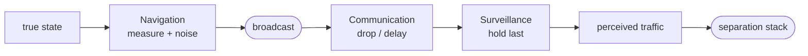

# CNS

**Communication, navigation, and surveillance (CNS)** is the layer that decides *what each aircraft perceives about the other aircraft*. The layer also decides how incorrect that knowledge is. The separation algorithms (CDaRR) use only the data that CNS gives them. They never use the ground truth. What an aircraft perceives about itself is not the same as what an intruder perceives about it. This difference is **asymmetric situational awareness**. This layer models the difference as accurately as the CNS systems permit.

The three parts make a chain. The chain starts at the ground truth of a source aircraft. The chain ends at the traffic that a receiver perceives.

- **[Navigation](navigation.md)** — how an aircraft measures its *own* state before it broadcasts. The error occurs at the source, and the model applies the error one time. Thus all the other aircraft get the same error through the broadcast.
- **[Communication](communication.md)** — if the broadcast arrives, and how late it arrives. The model draws the reception and the latency independently for each directed link.
- **[Surveillance](surveillance.md)** — the data that a receiver holds about a source. This data is the last message from that link. Before the first contact, the receiver holds no data.

Each part is a model with one method. Replace an implementation to change the experiment. This page is the overview. Each part has its own page with more data.

## The full chain in one figure

Use all three models together. The result is a **position error** in the data that each aircraft uses. Two aircraft, **i** and **j**, are in conflict. Aircraft **i** flies to the north-east at 10 m/s. Aircraft **i** receives the state of **j** with a probability of 1.0. Aircraft **j** flies to the west at 5 m/s. Aircraft **j** receives the state of **i** with a probability of 0.7. Each aircraft measures its own state with isotropic Gaussian GNSS noise (`pos_ci95 = 10 m`). Each aircraft broadcasts on a 1 Hz schedule with jitter. Each link has its own latency and reception probability.

The figure below shows the **asymmetric situational awareness**. Each row shows one aircraft's view of **itself**, of the **other aircraft**, and of the **relative position**. The tool samples each panel against the current ground truth during a long run. The tool then puts the ground truth at the centre. The scatter is similar to the scatter in real ADS-B reception data, for example the data from [Matthias Schäfer](https://ieeexplore.ieee.org/abstract/document/10976935).

<figure markdown="span">
  ![A 2x3 grid of scatter panels. Each panel shows the perceived position related to the ground truth at the origin. Column one shows each aircraft's view of itself. It is a Gaussian cloud with its centre on the ground truth, and it has no lag. Column two shows the view of the other aircraft. The same cloud moves to the rear of the motion arrow of the other aircraft. Aircraft i receives all the messages, and it holds a small cloud of the westbound aircraft j with a small offset to the east. Aircraft j loses messages, and it holds a cloud of the faster north-east aircraft i with a large offset to the south-west and a long tail. Column three shows the relative position. The bias is the same, but the cloud is larger, because it also contains the error in the aircraft's own position.](../../assets/img/perceived-position.png)
  <figcaption>A full summary of the <strong>asymmetric situational awareness</strong> from CNS uncertainty. No aircraft perceives the other aircraft at its true position, and the two views are different. The separation algorithms receive this relative state with its noise</figcaption>
</figure>

The **[Communication](communication.md)**, **[Navigation](navigation.md)**, and **[Surveillance](surveillance.md)** pages give the full explanation of this figure.

!!! code "Learn by doing"
    [L1.12, L1.14, and L1.16](../../tutorials/l1-parts.md) drive navigation, communication, and surveillance one at a time — the same chain as the figure above, built link by link.
