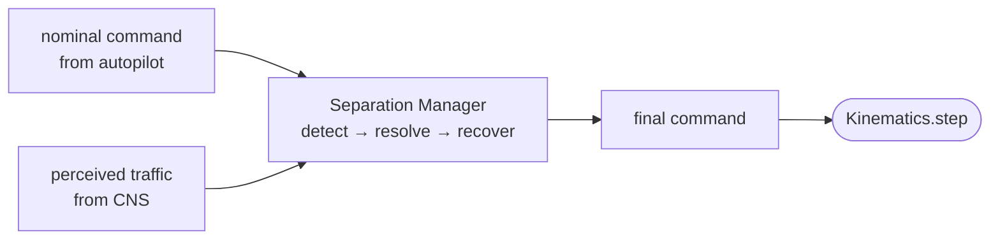

# Separation Manager

The **separation manager** is the conflict detection, resolution, and recovery criteria (CDaRR) safety overlay. It sits between the [autopilot](../aircraft/autopilot.md), which says what the aircraft *wants* to do, and the [kinematics](../aircraft/index.md), which says what the aircraft is physically *able* to do. Its one job each timestep is to decide whether the aircraft's nominal command from the autopilot is safe given the traffic it perceives, and if not, replace it with an avoidance command until the danger has passed.

It answers that by running three steps in order, and this is why conflict detection, conflict resolution, and recovery live under it here:

- **[Conflict Detection](conflict-detection.md)** predicts a loss of separation within a look-ahead time.
- **[Conflict Resolution](conflict-resolution.md)** computes the avoidance manoeuvre against the intruders currently in conflict.
- **[Recovery Criteria](recovery-criteria.md)** decides when the conflict has cleared and it is safe to return to the plan.

The separation manager is the orchestrator that runs **detect → resolve → recover** and turns their verdicts into a single command. Each of the three is a swappable model with its own page; this page is about the layer that composes them.

## Input and output

Every timestep, for one aircraft, the separation manager takes the aircraft's own (noisy) self-fix, the traffic it currently perceives through [CNS](../cns/index.md), and the nominal command the autopilot produced, and returns the command the airframe should actually fly:

Concretely, that is one method:

$$ \texttt{step}(\text{state},\ \text{perceived traffic},\ \text{nominal},\ \text{memory},\ \ldots) \longrightarrow (\text{command},\ \text{memory}) $$

with the detector, resolver, and recovery criterion injected alongside the protected-zone radius `rpz` and the look-ahead time. The output is the `MotionCommand` for this timestep and the aircraft's updated memory. While no conflict is live the output *is* the nominal, passed straight through, so an aircraft with nothing to avoid flies exactly what its autopilot asked for. The moment a conflict is predicted, the output becomes the resolver's avoidance command instead, and it stays there until recovery says the aircraft is clear, at which point it snaps back to the nominal. That is the Mission → Override → Mission switch a real detect-and-avoid vehicle flies.

One optional input is an **airframe adapter**: the resolvers speak in ground velocities, which a multirotor flies directly but a fixed-wing cannot. The adapter lowers the final command onto the channels the airframe can fly (a course and an airspeed for the fixed-wing), so the same resolver stays vehicle-neutral and one manager drives a mixed fleet.

## What it does inside

Detection, resolution, and recovery are pairwise primitives, and the manager is what generalises them to many intruders. It keeps a set of **active conflict pairs**: a pair becomes active when the detector flags it, resolution acts on the pairs *currently* detected, and recovery is checked for *every* active pair. The aircraft reverts to its nominal only once it is clear of **all** its conflicts, so the aggregate "resume when clear of everything" falls out of per-pair removals without the recovery criterion itself ever needing to know about more than one intruder. When a pair is active but not detected this instant, the aircraft coasts on its current velocity rather than snapping back early.

## No hidden state

The separation manager holds **no mutable state of its own**. A single instance is shared across the whole fleet, and every aircraft's conflict memory rides in a value that is threaded *into* `step` and returned *out*, never stored on the manager. This is not a style choice. The probabilistic-IPR machinery clones an aircraft by copying its state, and any future-affecting value kept *outside* that state would be silently shared between a clone and its parent, so a clone taken mid-conflict would fly differently from the original. Keeping the memory in the threaded value is what makes a clone independent. The same discipline runs through the [autopilot's](../aircraft/autopilot.md) guidance memory and the aircraft state itself.

## Beyond detect-resolve-recover

The classical detect → resolve → recover pipeline is one way to keep aircraft apart, and it is the separation manager that we assume as a default framework. But it is not the only shape a separation manager can take. What the layer really is, viewed from the loop, is an input-output function:

> given an aircraft's state, the traffic it perceives, and its nominal command, return the command it should fly.

Anything that honours that contract can stand in as the separation manager, whatever it does inside. For instnace, a learned policy like a **reinforcement-learning separation manager** would map the same perceived picture and nominal straight to a command, with the detect-resolve-recover reasoning replaced by a trained network rather than three hand-built geometric pieces. We haven't tested it yet, and we would like to hear from you!

That is the direction this layer is built to grow in: promoting the separation manager to a swappable interface, with the classical orchestrator as one implementation and a learned policy as another, both judged on the same standard by the same [scenarios](../scenarios/index.md) and metrics.

## The three contracts

Each stage the manager orchestrates is an abstract base class with a single method, and each has a default. To replace one you subclass it, implement the one method, and pass the instance in; the loop, the fleet, and the other two stages do not change.

| stage | base class | method to implement | returns | default |
|---|---|---|---|---|
| [detection](conflict-detection.md) | `ConflictDetector` | `detect(own, intr, rpz, t_lookahead)` | `bool` | `StateBased` |
| [resolution](conflict-resolution.md) | `ConflictResolver` | `resolve(own, intruders, rpz, preferred)` | `MotionCommand` | `MVP` |
| [recovery](recovery-criteria.md) | `RecoveryCriterion` | `should_resume(own, intr, rpz)` | `bool` | `PastCPA` |

All three are **directed** — computed from the ownship's point of view against its perceived traffic — and **pure**, a function of their arguments only, for the same no-hidden-state reason as above. One class may implement more than one interface and fill more than one slot; [Build your own → Separation Manager](../../build-your-own/separation-manager/index.md) works that idea all the way up to a monolithic end-to-end policy.

!!! code "Learn by doing"
    [L1.8–L1.10](../../tutorials/l1-parts.md) drive the three stages one at a time, and [L2](../../tutorials/l2-simulation.md) assembles them under the manager in a full run. A stage of your own is [L7](../../tutorials/l7-write-your-own.md).
