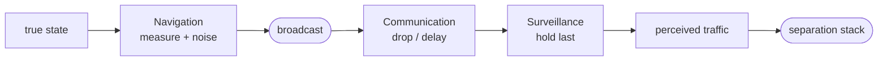

# CNS

**Communication, navigation, and surveillance (CNS)** is the layer that decides *what each aircraft knows about the others*, and how imperfect that knowledge is. It is the information that is passed to the separation algorithms (CD&R). The algorithm, in reality, acts only on what the CNS delivers. There is a real gap between what an aircraft perceived of itself compared to what is perceived by the intruder, this is called **asymmetric situational awareness**. This layer aims to make a realistic picture of the CNS systems.

The three parts form a chain, from a source aircraft's true state to the picture a receiver ends up acting on:

- **[Navigation](navigation.md)** — how an aircraft measures its *own* state to broadcast. The error lives at the source and is applied once, so everyone else inherits it through the broadcast.
- **[Communication](communication.md)** — whether that broadcast is delivered, and how late. Reception and latency, drawn independently on every directed link.
- **[Surveillance](surveillance.md)** — what a receiver *holds* about a source as a result: the last message that link delivered, or nothing at all before first contact.

Each is a pluggable model with a single method, you can swap an implementation to change the experiment. This page is the map, each part is elaborated on its own page.

## The whole chain, in one picture

Run all three together and the effect is a **position error** on what each aircraft acts on. Suppose that two aircraft, **i** and **j** is in conflict. Aircraft **i** is flying north-east at 10 m/s and receiving **j**'s state at probability of 1.0. Aircraft **j** is flying west at 5 m/s and receiving **i**'s state at 0.7. Each measure themselves with isotropic Gaussian GNSS noise (`pos_ci95 = 10 m`), broadcast on a jittered 1 Hz schedule, and hear the other over link with latency and reception probability.

Below is the **asymmetric situational awareness**. Each row is one aircraft's view of **itself**, of the **other**, and of their **relative position**. Every panel is sampled against the current ground truth over a long run and recentred on it. The resulting scatter is similar to what is seen in real ADS-B reception data, for instance, the observations reported by [Matthias Schäfer](https://ieeexplore.ieee.org/abstract/document/10976935).

<figure markdown="span">
  ![A 2x3 grid of scatter panels of perceived position relative to ground truth at the origin. Column one, each aircraft's view of itself: a Gaussian cloud centred on the truth, no lag. Column two, its view of the other: the same cloud shifted behind the other's motion arrow — i, receiving perfectly, holds a compact cloud of the westbound j drifting a little east; j, receiving lossily, holds a far south-west-shifted, tail-heavy cloud of the faster north-east i. Column three, the relative position: the same bias but a wider cloud, because it also carries the aircraft's own self-fix error.](../../assets/img/perceived-position.png)
  <figcaption>A complete summary of the <strong>asymmetric situational awareness</strong> that CNS uncertainty produces. Neither sees the other where it is, nor the same way the other does. The noisy relative state is what is passed to the separation algorithms</figcaption>
</figure>

Everything in that picture is explained on the **[Communication](communication.md)**, **[Navigation](navigation.md)**, and **[Surveillance](surveillance.md)** page.
