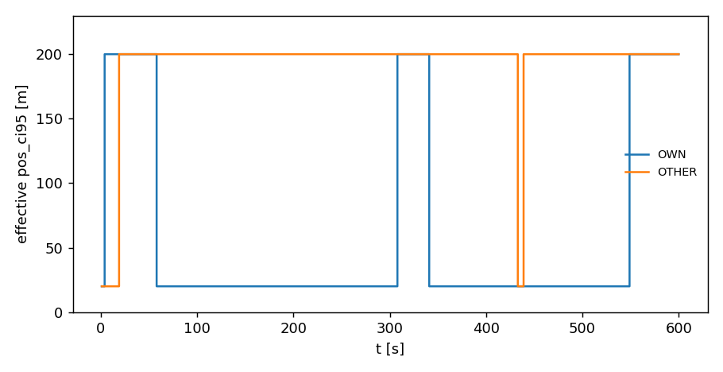

# Navigation

Navigation is where an aircraft finds out where it is — and gets it slightly wrong.

That is the whole job: one aircraft, its own sensor, one measurement. Everything downstream inherits the mistake. The aircraft broadcasts the wrong position, the other aircraft believes it, and the conflict logic on both sides works from it. The error is applied **once, at the source**, so a single bad fix corrupts every receiver's picture of that aircraft at the same moment.

Navigation is the **N** of [CNS](index.md). What it produces is handed to [communication](communication.md), which decides whether it arrives.

## What is actually in the module

Small. One model, four error shapes, one degradation effect, and the values they pass around.

| what | name | in one line |
|---|---|---|
| the model | `GnssNavigation` | measures position and velocity, each with a pluggable error |
| error shape | `gaussian` | round, well-behaved — the default |
| | `make_mixture_gaussian` | round, but with occasional large outliers |
| | `make_anisotropic_gaussian` | an ellipse: worse north–south than east–west |
| | `make_anisotropic_mixture_gaussian` | both at once |
| degradation | `GnssOutage` | a receiver that gets worse, and maybe recovers |
| what it returns | `Message` | the noisy fix, plus the time it was taken |
| what it remembers | `NavState` | anything an effect needs between ticks |
| how bad it is | `NavQuality` | how much worse than nominal, and how much is admitted |
| the interfaces | `NavigationModel`, `NoiseDistribution`, `NavEffect` | for writing your own |

That is the complete list. If you want a bias that grows over time, a proper multipath model, or a receiver that degrades over a city, none of those ship — and [writing your own](#writing-your-own) is shorter than it sounds.

## Accuracy belongs to the aircraft, not the model

The obvious design would be `GnssNavigation(accuracy=20.0)`. That is not what happens, and the reason is worth a minute.

A fleet has one navigation model but many receivers, and they are not equally good. One aircraft might carry a survey-grade unit and another a cheap one; the same aircraft might have a clean fix over open country and a poor one between buildings. So the two numbers live on the **aircraft**:

- `pos_ci95` — position accuracy in metres
- `vel_ci95` — velocity accuracy in m/s

Both default to `0.0`, meaning a perfect sensor, so a run with no navigation noise needs no configuration at all.

```python
nav = GnssNavigation()
message = nav.measure(nav.initial_state(), true_state, t=5.0, rng=rng)

message.state.lat       # the measured position, not the true one
message.t_meas          # when it was taken -- communication needs this to know how stale it is
message.state.pos_ci95  # what the broadcast claims about itself
```

### What "95%" means, and where 0.4085 comes from

Accuracy is quoted the way a receiver's datasheet quotes it: a **95% radial CI** — the radius of a circle containing 95 fixes out of 100. It is *not* a standard deviation, and confusing the two is a factor-of-2.4 mistake.

The error is drawn as a round 2D Gaussian, one draw per axis. The distance from the truth then follows a Rayleigh distribution whose 95th percentile sits at $\sigma\sqrt{5.9915}$, so hitting a stated 95% radius means

$$\sigma = \frac{\text{CI95}}{\sqrt{5.9915}} \approx 0.4085 \times \text{CI95}$$

A 20 m accuracy is a per-axis sigma of about 8.2 m. Measured over 8 000 fixes, the 95th percentile of the error comes out at 19.7 m against a 20 m target, with 95.4% of fixes inside the circle.

## The four error shapes

The *size* of the error is `pos_ci95`. Its **shape** is a separate choice, and four ship with the library. Position and velocity take independent ones, because they come from different measurements inside the same receiver — position from timing the satellite signals, velocity from their Doppler shift — and there is no reason for them to misbehave together.

<figure markdown="span">
  
  <figcaption>The four shapes at the same 20 m accuracy. The grey circle is <code>pos_ci95</code> in every panel, and 95% of the points fall inside it in all four — that is the contract they share.</figcaption>
</figure>

| shape | what it looks like | when you would use it |
|---|---|---|
| `gaussian` | a round blob | the default; fine unless you have a reason |
| `make_mixture_gaussian` | round, plus rare far-out points | multipath — signals bouncing off buildings |
| `make_anisotropic_gaussian` | an ellipse, taller than wide | satellite geometry favouring one direction |
| `make_anisotropic_mixture_gaussian` | a tall ellipse with outliers | both problems at once |

The ellipse is **axis-aligned, not aligned with the aircraft**. GNSS error is shaped by where the satellites are, not by which way the aircraft happens to be pointing, so the distribution never sees the heading.

!!! note "The same advertised accuracy hides a factor-of-two difference in the worst case"
    All four keep 95% of their fixes inside a 20 m circle. Over 20 000 draws, the worst single fix was **40.7 m** for `gaussian` and **79.0 m** for the anisotropic mixture. If your question is how often the *unlucky* case bites, the shape is the whole answer and the accuracy figure tells you nothing.

A single number can say how big an error is but never what it looks like. That is the entire reason there is more than one shape.

## Saying one thing and doing another

A broadcast carries an accuracy figure — the sender telling everyone how much to trust it. By default that is the truth: the error is drawn from `pos_ci95` and the same number goes on the air.

Setting `pos_ci95_declared` breaks the two apart, which is how you study a sensor that misreports itself:

```python
liar = replace(aircraft, pos_ci95_declared=5.0)   # 20 m error, claims 5 m
```

The claim never touches the draw — same seed, same fix, only the label changes. Two cases, with opposite consequences:

- **Claiming better than reality.** The receiver sizes its safety margin from a confident number that is wrong. This is the integrity failure that receiver autonomous integrity monitoring exists to catch, and the only case where an aircraft acts confidently on bad data.
- **Claiming worse than reality.** A transmitter derating itself. Receivers are more cautious than they need to be — wasteful, not dangerous.

## A receiver that gets worse

Everything above assumes the sensor is as good at the end of the flight as at the start. `NavEffect` is the hook for one that is not, and `GnssOutage` is the only implementation that ships.

It models a receiver losing satellites: the fix gets **worse**, it does not stop. That distinction is deliberate — an aircraft with a degraded GNSS still broadcasts a position, just a bad one. An aircraft that stops transmitting altogether is a *radio* failure and lives on the [communication](communication.md) side as `RadioHealth`. One physical event, one spelling.

```python
GnssOutage(
    fail_rate=40.0,      # outages per hour
    recover_rate=25.0,   # per hour; 0 (the default) means it never recovers
    pos_factor=10.0,     # how many times worse the fix is while degraded
    declare=True,        # does the broadcast admit it?
)
```

<figure markdown="span">
  
  <figcaption>Two receivers under the same outage model, ten minutes. They fail and recover independently — over this run one was degraded 23% of the time and the other 96%. With <code>recover_rate=0</code> the step up would never come back down.</figcaption>
</figure>

Two details matter more than they look.

**Rates are per hour, not per broadcast.** A mean time to failure of half an hour is half an hour whether the aircraft transmits at 1 Hz or 2 Hz. Had the rate been per-message, changing the broadcast cadence would silently change the failure rate too, and a cadence study would be measuring two things at once.

**`declare` is the interesting switch.** `True` is an honest transponder derating itself, so receivers widen their margins and behave sensibly. `False` is the fix going bad while the broadcast keeps claiming nominal — the case that actually hurts, because now everyone is confidently wrong.

!!! note "Estimate an outage study with plain Monte Carlo, not the rare-event estimator"
    A rare outage is the wrong shape for splitting. It is a sudden jump, and minimum separation carries no clue about whether it has happened, so the [shells](../../estimators/rare-event/index.md) cannot steer toward it. A *continuous* accuracy degradation is a different matter — that couples to separation and splits fine. A permanently degraded sensor needs no effect at all: it is just a larger `pos_ci95`.

## Why the model has two methods

`NavigationModel` requires `measure` and offers `evolve`. The split confuses people, so:

| | `evolve` | `measure` |
|---|---|---|
| runs | once per tick, for every aircraft | once per aircraft that is transmitting |
| may | change what the model remembers | only read it |
| gives back | the updated memory | the `Message` |

**Everything that changes state goes in `evolve`**, and the reason is reproducibility. Only some aircraft transmit on any given tick, so if `measure` advanced the state, the number of random draws taken would depend on *who happened to transmit* — and changing the broadcast schedule would shift every later random number in the run. Advancing once per tick, regardless of who fires, keeps the draws in a fixed place.

If your model is stateless, ignore `evolve`: the default does nothing and draws nothing.

## Writing your own

### An error shape

A shape is any function taking a generator and an accuracy and returning an east/north error in metres. Not a class, not a subclass — a function.

```python
def uniform_disk(g, ci95):
    radius = ci95 / math.sqrt(0.95)          # sized so 95% lands inside ci95
    r = radius * math.sqrt(g.random())
    a = g.uniform(0.0, 2.0 * math.pi)
    return r * math.cos(a), r * math.sin(a)

nav = GnssNavigation(pos_distribution=uniform_disk)
```

!!! note "Draw the same number of times whatever the accuracy is, including zero"
    If a shape short-circuits at `ci95 == 0` and skips its draws, every later random number in that run shifts — and a sweep over `pos_ci95` stops being a controlled comparison, because the zero cell sits on a different noise stream from its neighbours. Scaling the output by zero costs nothing; skipping the draw costs correctness.

### A degradation effect

Three methods: what the state starts as, how it advances, and what it means for one aircraft. Return a `NavQuality` saying how much worse the fix is (`pos_scale`) and how much of that the broadcast admits to (`pos_declared`); both at `1.0` means nothing has gone wrong. Several effects compose by multiplying.

The same drawing rule applies, for the same reason.

Worked examples of both are in **[Build your own → CNS → Navigation](../../build-your-own/cns/navigation.md)**.

## Where the fix goes next

The `Message` this module produces goes to [communication](communication.md), which decides whether it arrives and how late, then to [surveillance](surveillance.md), which decides what a receiver believes in between deliveries. What comes out the far end is the only view the [conflict logic](../separation/index.md) ever gets.

The outcome of a run, though, is scored on the **true** states. Navigation error changes what the aircraft *do*; it never changes what is measured of them.

## In the code

The module is [`opencdarr/cns/navigation.py`](https://github.com/fazlurnu/OpenCDaRR/blob/main/opencdarr/cns/navigation.py) and the shapes are in [`noise_distributions.py`](https://github.com/fazlurnu/OpenCDaRR/blob/main/opencdarr/cns/noise_distributions.py). Every number and both figures on this page come from [`examples/handbook/navigation.ipynb`](https://github.com/fazlurnu/OpenCDaRR/blob/main/examples/handbook/navigation.ipynb) — run it top to bottom to reproduce them.
