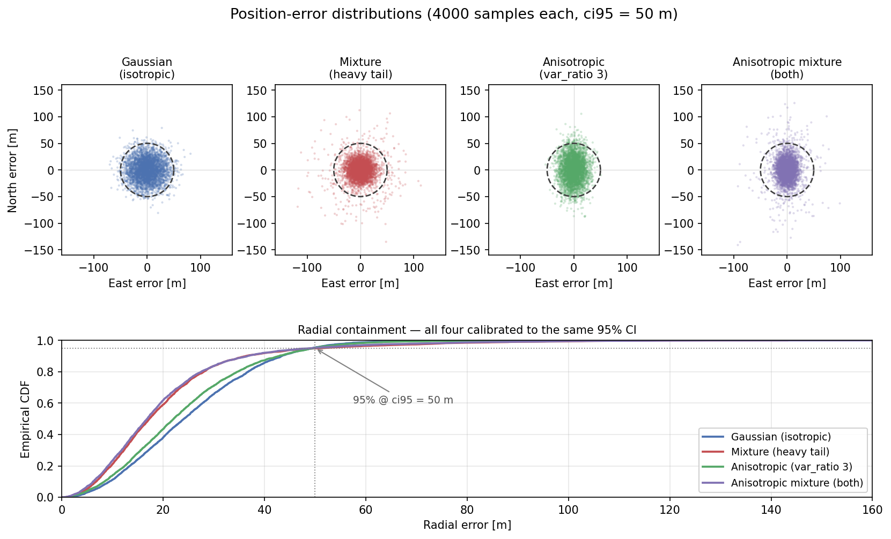
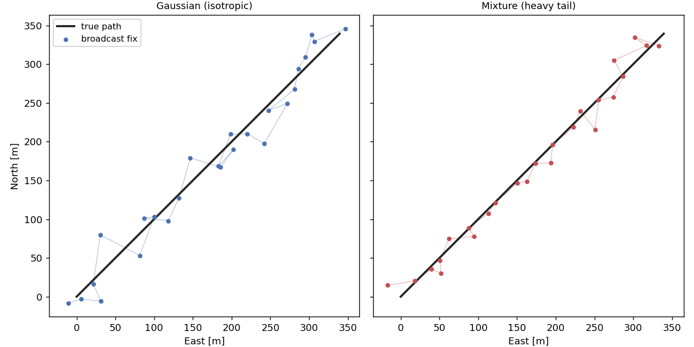

# Navigation

Navigation is the **N** of [CNS](index.md): given an aircraft's true state, it reports what that aircraft's own sensor measures. In OpenCDaRR the sensor is GNSS (GPS/ADS-B), modelled by
[`GnssNavigation`](https://github.com/fazlurnu/OpenCDaRR/blob/main/opencdarr/cns/navigation.py),
which measures position and velocity, each perturbed by a pluggable 2D error distribution, and returns a broadcastable `Message`. The error lives at the source and is applied once — everyone else perceives it through the broadcast that [communication](communication.md) then delivers.

## Where the noise magnitude lives

The noise magnitude is **not** a parameter of the navigation object. It is read
from the aircraft being measured, via two fields on `AircraftState`:

- `pos_ci95` — 95% radial position accuracy [m]
- `vel_ci95` — 95% radial velocity accuracy [m/s]

Accuracy is a property of *that aircraft's* sensor: it can differ between
aircraft and may evolve over a run (e.g. degrading GPS coverage), so it travels
with the clonable state rather than sitting on a shared navigation object. The
default `0.0` on both means a perfect sensor — the measurement equals the truth,
a clean regression to the no-noise case. `GnssNavigation` also **stamps an
accuracy onto the broadcast**, so a receiver gets the sender's declared accuracy
*with* the message, as ordinary state. By default that is the same number the
error was drawn from; [declaring a different one](#declaring-a-different-accuracy)
is how you study a sensor that misreports itself.

## Position error — from CI95 to σ

Position error is a zero-mean 2D isotropic Gaussian, each axis \(N(0, \sigma^2)\).
GNSS accuracy is quoted as a **95% radial CI** — the radius containing 95% of
fixes. The radial distance is Rayleigh, whose 95% quantile is
\(\sigma\sqrt{\chi^2_{2,0.95}}\) with \(\chi^2_{2,0.95} = 5.9915\), so

\[
\text{CI95} = \sigma\sqrt{5.9915} = 2.4477\,\sigma
\quad\Longrightarrow\quad
\sigma = \frac{\text{CI95}}{2.4477} \approx 0.4085\,\text{CI95}.
\]

The error is drawn in the local East–North frame by the pluggable distribution,
\((\text{rng}, \text{CI95}) \mapsto (e_E, e_N)\), and the measured position is the
true position offset by that error through the project's own geodesy:

\[
\beta = \operatorname{atan2}(e_E, e_N), \quad
\rho = \sqrt{e_E^2 + e_N^2}, \quad
(\varphi', \lambda') = \texttt{geo.forward}(\varphi, \lambda, \beta, \rho).
\]

## Velocity error

Velocity error is per-axis Gaussian \(N(0, \sigma_v^2)\) on the East–North
components, with the same isotropic-2D CI95→σ conversion
(\(\sigma_v = \text{vel\_ci95} / 2.4477\)). It is applied to the true velocity and
converted back to a measured track and ground speed:

\[
(v_E, v_N) = \big(v\sin\psi + \varepsilon_E,\; v\cos\psi + \varepsilon_N\big),
\quad
\psi' = \operatorname{atan2}(v_E, v_N), \quad
v' = \sqrt{v_E^2 + v_N^2}.
\]

The result is a `Message(source, state, t_meas)` — the noisy self-measurement,
timestamped for the communication layer to deliver.

!!! note "The own self-fix carries noise, but never staleness"
    An aircraft decides on its **own noisy self-fix**, not on its true state —
    both endpoints of an encounter carry navigation error. What the own fix skips
    is the [communication](communication.md) layer: an aircraft always has a
    *fresh* measurement of itself, never a dropped or stale one, whereas its view
    of **others** is whatever the broadcast last delivered. All navigation draws
    come from one dedicated RNG substream, drawn in agent order, so a run is fully
    reproducible.

## Noise distributions

A noise distribution is any callable matching the `NoiseDistribution` protocol:

```python
(rng: np.random.Generator, ci95: float) -> tuple[float, float]   # (east, north) error [m]
```

OpenCDaRR ships four, all in
[`opencdarr/cns/noise_distributions.py`](https://github.com/fazlurnu/OpenCDaRR/blob/main/opencdarr/cns/noise_distributions.py):

| Distribution | Factory | Shape |
|---|---|---|
| Isotropic Gaussian | `gaussian` | circular, thin-tailed |
| Heavy-tail mixture | `make_mixture_gaussian(tail_ratio, tail_weight)` | circular, occasional large outliers |
| Anisotropic Gaussian | `make_anisotropic_gaussian(var_ratio)` | elliptical (North axis wider) |
| Anisotropic mixture | `make_anisotropic_mixture_gaussian(...)` | elliptical **and** heavy-tailed |

The first invariant every distribution preserves: **the 95th percentile of the
2D radial error equals `ci95`**. That containment is what makes them
interchangeable — you can swap in a heavier tail or an ellipse without changing
what "50 m accuracy" means. For the Gaussian this is closed-form; for the others
the calibrating scale is solved once per `ci95` by bisection and cached in the
factory's closure, so per-sample draws stay cheap.

The second: **every distribution draws the same number of times whatever `ci95`
is**, including zero, where the error is exactly `(0, 0)` but the draws still
happen. A sweep such as `pos_ci95 = Sweep([0, 10, 20, 40])` compares four cells
that should differ only in the accuracy; if the zero cell skipped its draws,
every random number after it in that run would shift and the cell would no longer
be the same experiment with a different parameter. Scaling by σ costs nothing at
zero, so drawing unconditionally is free.



The scatters (top) all sit inside the same dashed `ci95` circle; the radial CDFs
(bottom) all cross 0.95 at the same radius. The tail and the ellipse reshape
*where* the error lands without changing the 95% budget — and note the anisotropy
is invisible in the radial CDF: it only reshapes the scatter.

!!! info "Anisotropy is axis-aligned, not track-aligned"
    The wider axis of the anisotropic distributions is always **North**, not the
    aircraft's heading. GPS position-error anisotropy comes from satellite
    geometry, not the vehicle's direction of travel, so the error ellipse is not
    oriented by track.

## A trajectory with the noise

Put navigation together with a moving aircraft and the noise becomes a stream of
**broadcast fixes** scattered around the true path. Below, one aircraft flies a
straight constant-speed leg (`pos_ci95 = 40 m`, a fix every 2 s); each dot is what
a receiver would actually see for that tick.



Both panels share the same `ci95`, so the fixes stay within a comparable band of
the true path. The difference is in the tails: the **Gaussian** jitters evenly
around the line, while the **heavy-tail mixture** hugs the path more tightly most
of the time but throws the occasional large outlier — the kind of rare, large
error that dominates safety metrics. This is the whole point of the pluggable
design: same declared accuracy, different failure behaviour.

The plot above is produced by measuring the true state at each tick:

```python
import numpy as np
from opencdarr.cns import GnssNavigation, make_mixture_gaussian
from opencdarr.state import AircraftState

nav = GnssNavigation(pos_distribution=make_mixture_gaussian(tail_ratio=3.0, tail_weight=0.1))
rng = np.random.default_rng(0)

true = AircraftState(id="OWN", lat=52.0, lon=4.0, trk=45.0, gs=10.0,
                     pos_ci95=40.0, vel_ci95=0.0)

state = nav.initial_state()                      # the layer's own state; empty for a plain model
msg = nav.measure(state, true, t=0.0, rng=rng)   # the broadcast fix a receiver sees
print(msg.state.lat, msg.state.lon)              # noisy position; the declared ci95 rides along
```

The `state` argument is what lets a navigation model remember something between
ticks. A plain `GnssNavigation` ignores it; a model carrying an
[effect](#degradation-that-persists) reads its own degradation out of it.

## Declaring a different accuracy

A broadcast carries one accuracy: the sender's **claim**. By default that is the
truth — the error is drawn from `pos_ci95` and the same number goes on the air.
Two further fields break them apart:

- `pos_ci95_declared` — what the broadcast claims about position [m]
- `vel_ci95_declared` — the same for velocity [m/s]

Both default to `None`, meaning "claim the truth", so an honest transmitter needs
no second number and every existing scenario is unchanged. Setting one gives you
a sensor that misreports itself, in either direction:

```python
import dataclasses

honest = AircraftState(id="OWN", lat=52.0, lon=4.0, trk=45.0, gs=10.0, pos_ci95=40.0)
boastful = dataclasses.replace(honest, pos_ci95_declared=5.0)   # 40 m error, claims 5 m
```

The error still scatters at 40 m in both cases; only the number on the wire
changes. Over-declaring is the case receiver autonomous integrity monitoring
(RAIM) exists to catch: downstream logic that sizes its uncertainty from the
broadcast — [`ProbabilisticFTR`](../separation/recovery-criteria.md), for
instance — acts on a confident number that is wrong. Under-declaring is a transmitter
derating itself, which makes receivers more cautious than they need to be.

Only a *true* state ever needs both numbers. The message carries just the claim,
in `pos_ci95`, which is what a receiver reads.

## Degradation that persists

Everything above is memoryless: each fix is an independent draw. A receiver that
loses satellites and **stays** degraded needs the model to remember something
between ticks, which is what a `NavEffect` provides.

An effect answers one question per aircraft — how much worse is this fix right
now — as a `NavQuality`: four multipliers, two scaling the error actually drawn
and two scaling what the broadcast claims. Several effects compose by
multiplying, with `1.0` as the identity.

`GnssOutage` is the reference implementation:

```python
import numpy as np
from opencdarr.cns import GnssNavigation, GnssOutage, gnss_outage

# fail_rate is per hour: 600/h is a mean time to outage of 6 s.
nav = GnssNavigation(effects=(GnssOutage(fail_rate=600.0, pos_factor=10.0, declare=True),))
rng = np.random.default_rng(0)

own = AircraftState(id="OWN", lat=52.0, lon=4.0, trk=45.0, gs=10.0, pos_ci95=20.0)
state = nav.initial_state()
for k in range(1, 8):
    state = nav.evolve(state, [own], t=float(k), rng=rng)   # once per tick, whole fleet
    fix = nav.measure(state, own, t=float(k), rng=rng).state
    print(k, sorted(gnss_outage(state).out), round(fix.pos_ci95, 1))
```

```text
1 [] 20.0
2 [] 20.0
3 [] 20.0
4 [] 20.0
5 ['OWN'] 200.0
6 ['OWN'] 200.0
7 ['OWN'] 200.0
```

At 1 Hz and this seed the receiver runs nominal for four ticks, degrades at
`t = 5 s`, and stays degraded — the declared accuracy going from 20 m to 200 m
alongside the error, because `declare=True`. `evolve` is called once per tick
over the whole fleet, before anyone measures, so what an effect draws does not
depend on which aircraft happened to transmit.

Rates are per **hour** and applied over elapsed time, so the mean time to an
outage is `1 / fail_rate` hours regardless of how often the aircraft broadcasts —
a cadence sweep then moves one thing rather than two. A zero `recover_rate` (the
default) means the outage latches for the rest of the run.

`declare` is the fork. With `declare=True` the transponder derates itself and
receivers widen their uncertainty to match. With `declare=False` the fix degrades
while the broadcast keeps claiming nominal accuracy — the misleading-information
case, and the only one where downstream logic acts confidently on a wrong number.
The two lead to opposite conclusions, so neither can be a silent default.

!!! info "An effect degrades a fix; it never suppresses a broadcast"
    A receiver that has lost satellites reports a *worse* position, not no
    position, so an effect scales accuracy rather than silencing the aircraft. An
    aircraft that stops transmitting altogether is a **communication** failure —
    `RadioHealth` on the [channel](communication.md) — not a navigation one. The
    same physical event has one spelling, on the side where the link lives.

!!! warning "The rare-event sampler reaches a continuous degradation, but not an outage jump"
    A *continuous* accuracy degradation is coupled to minimum separation — a
    bigger position error gives worse geometry gives less separation — so the
    splitting shells reach it normally. A discrete outage is a jump the level
    function carries no information about, so the shells cannot steer toward it.
    Estimate a `fail_rate > 0` study by plain Monte Carlo, or condition on the
    failure time and reweight. A *permanently* degraded sensor needs no effect at
    all: it is just a larger `pos_ci95`.

## Adding your own

A distribution is just a callable, so you can add one without subclassing — write
a plain function or a calibrating factory that preserves the two invariants
above. An effect is a small class with three methods. See
**[Build your own → CNS → Navigation](../../build-your-own/cns/navigation.md)**
for both, with worked examples.

The [navigation notebook](https://github.com/fazlurnu/OpenCDaRR/blob/main/examples/handbook/navigation.ipynb)
runs everything on this page end to end.
