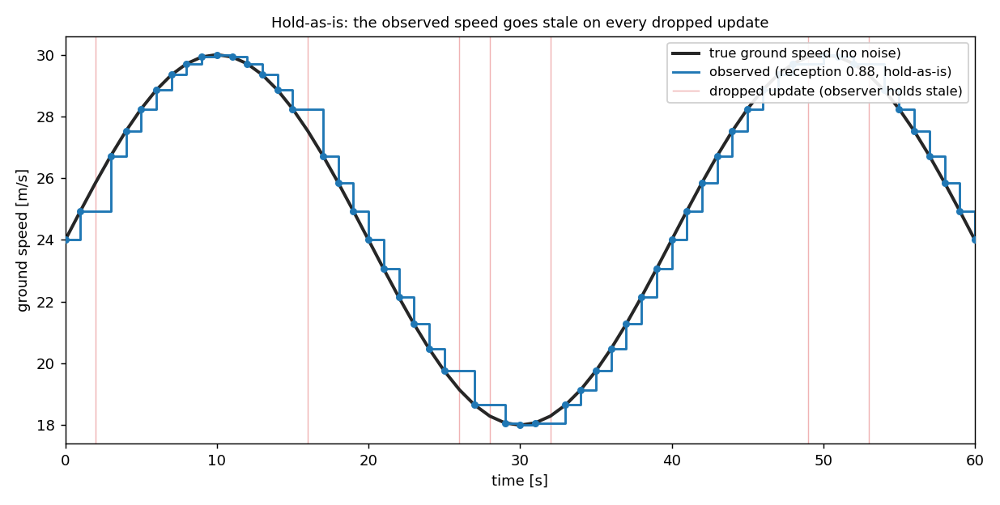
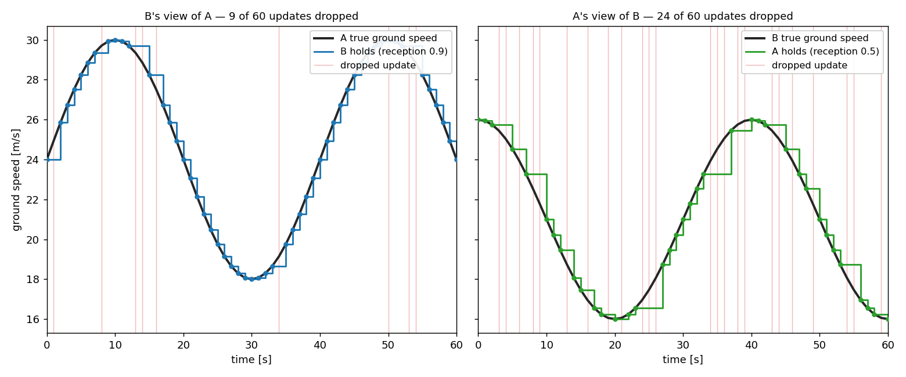

# Surveillance

Surveillance is the **S** of [CNS](index.md): given the messages [communication](communication.md) delivers or drops, what does an aircraft end up *holding* as its picture of the traffic? It is the receiving end of the chain — the state a decision actually reads.

The default model, `LastKnown`, holds exactly the **last message each directed link delivered** — hold-as-is, with no dead-reckoning forward. Before a link's first delivery it holds *nothing*, and that neighbour is dropped from the perceived set entirely until first heard, rather than guessed at.

## Hold-as-is, not dead-reckoning

When an update is dropped or delayed, a receiver has a choice: **hold** the last message unchanged, or **extrapolate** it forward — dead-reckon the source along its last known velocity. `LastKnown` holds. The reasoning is in [ADR 0006](https://github.com/fazlurnu/OpenCDaRR/blob/main/vault/decisions/0006-communication-model-design.md): extrapolation assumes the source kept flying straight, which is wrong exactly when it matters most — the moment the source *starts* manoeuvring is the moment a dead-reckoned estimate diverges from reality. Holding the last message is the honest representation of what the receiver actually has: a fix of known age, not a guess dressed up as a measurement.

The consequence is that the perceived state goes **stale** between updates. Below, a source flies a noise-free but time-varying ground speed and broadcasts it every second; the observer receives each broadcast only with probability 0.88 (an [ADS-B reception model](communication.md) — reception is a Bernoulli trial per link). Every dropped update leaves the observer holding the previous value, so the observed speed is a staircase that lags the truth.



There is no measurement noise here at all — the source's speed is exact, and every *delivered* fix is exact. The entire gap between the black curve and the blue staircase comes from **missed messages alone**: at 0.88 reception roughly one broadcast in eight is dropped, and the observer simply keeps the last one it heard until the next arrives. The lag is largest where the true speed changes fastest (the steep parts of the curve) and vanishes at the turning points, where a stale value happens to still be right. This is the whole point of hold-as-is: staleness is visible and bounded by the update interval, rather than hidden inside a plausible-looking extrapolation.

```python
from opencdarr.cns.base import CommState, Message
from opencdarr.cns.communication import Comm
from opencdarr.cns.surveillance import LastKnown
from opencdarr.rng import generator, root_seed_sequence
from opencdarr.state import AircraftState

comm = Comm(reception_prob={("SRC", "OBS"): 0.88})   # 88% of broadcasts reach OBS
surveil = LastKnown()
rng = generator(root_seed_sequence(0))
state = CommState()

source = AircraftState(id="SRC", lat=52.0, lon=4.0, trk=90.0, gs=24.0, vel_ci95=0.0)
state = comm.step(state, [Message("SRC", source, t=0.0)], ["SRC", "OBS"], t=0.0, rng=rng)

perceived = surveil.perceived(state, receiver="OBS", source="SRC", t_now=0.0)
print(perceived.gs if perceived else "not heard yet")   # the held speed, or None before first contact
```

## Staleness is instrumentation, not behaviour

Because hold-as-is never alters the held state, *how old* a belief is has no effect on what detection or resolution reads — it only tells you how much to trust it. `surveillance.age(state, receiver, source, t_now)` reports that age (`t_now − t_meas` of the held message, or `None` if nothing is held). It is a free function rather than a method precisely because every surveillance model would report the same age: staleness is a property of the message's timestamp, not of what the model does with it.

## Asymmetric perception

Reception and latency are drawn per **directed link**, so `A→B` can be delivered while `B→A` is dropped in the same tick. Two aircraft in the same encounter therefore build up *different* pictures of each other — one may be acting on a fresh fix while the other holds a stale one.

Below is a single encounter with a deliberately lopsided channel: `A→B` is reliable (reception 0.9) while `B→A` is lossy (reception 0.5). Both aircraft fly noise-free speed profiles and broadcast every second, yet the two views are nothing alike.



**B tracks A almost perfectly**, holding for a tick or two at most; **A's picture of B is coarse and often seconds stale**, freezing across long runs of dropped updates. Same encounter, same instant — but the quality of what each aircraft knows about the other is set entirely by its own incoming link.

That asymmetry is what feeds the separation stack: [detection](../conflict-detection.md), [resolution](../conflict-resolution.md), and [recovery](../recovery-criteria.md) each run on the receiver's own perceived set, never on the truth, so two aircraft can disagree about whether a conflict even exists — and it is exactly the aircraft with the worse link, seeing the stalest picture, that is least equipped to notice.
