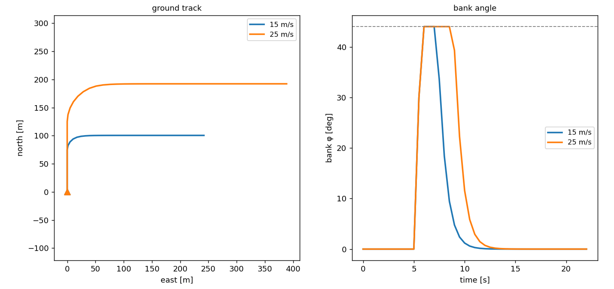
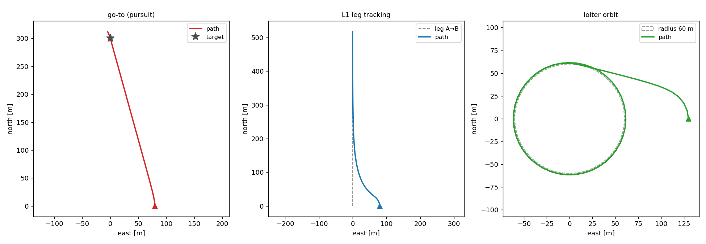

# Fixed-wing

The fixed-wing is a **coordinated-turn point mass**. It flies its airspeed vector, turns by banking, and cannot stop or move sideways — it must stay above stall the whole time. The bank angle is part of the state and changes at a finite roll rate, so a turn rolls in, holds, and rolls out rather than snapping. The model is re-derived from the kinematic point-mass model of [Reyner and Liem](https://www.mdpi.com/2504-446X/10/5/337), the same kinematics [PX4](https://docs.px4.io/main/en/ros/offboard_control)'s fixed-wing controller implements. We use a small-UAV envelope — cruise up to `v_max` 25 m/s, stall `v_min` 12 m/s, airspeed acceleration `a_x` 2 m/s², bank up to `phi_max` 44°, and roll rate 60 °/s. These are a `Performance` value, so you can set your own — see [Build your own → Performance](../../build-your-own/performance.md).

## Equation of motion

The state carries the airspeed $V$, the heading $\psi$ (the direction of the airspeed vector), and the bank $\phi$. Airspeed is clamped into the envelope and ramped toward the target, exactly as for the multirotor but with a **positive** minimum, the stall speed.

$$ V' = V + \operatorname{clip}\!\left(V_\text{cmd} - V,\; \pm a_x\,\Delta t\right), \qquad V \in [V_s,\; V_\max] $$

A fixed-wing turns by banking. A coordinated turn at bank $\phi$ produces a heading rate, and integrating it turns the aircraft.

$$ \dot\psi = \frac{g\tan\phi}{V}, \qquad R = \frac{V^2}{g\tan\phi} $$

The turn radius $R$ is therefore **speed-dependent**. At the same bank a faster aircraft turns wider. The bank itself is a state that moves toward the bank the guidance asks for at no more than the roll rate $p_\max$, which is what rounds the start and end of every turn.

$$ \phi' = \operatorname{clip}\!\left(\phi + \operatorname{clip}(\phi_\text{cmd} - \phi,\; \pm p_\max\,\Delta t),\; \pm\phi_\text{max,eff}\right) $$

The bank is capped by the structural limit `phi_max`, tightened near stall. A turn raises the stall speed by its load factor, so the closer the airspeed is to stall, the less the aircraft may bank.

$$ \phi_\text{max,eff} = \min\!\left(\phi_\max,\; \arccos\!\left[(V_s / V)^2\right]\right) $$

Position advances along the airspeed vector plus the wind. Without wind the heading equals the ground-track course and airspeed equals ground speed. Under wind the aircraft **crabs** — it points its nose off the intended course so the airspeed vector plus the wind makes the course good — and a constant-bank turn traces a trochoid over the ground.

## MotionCommand

A `MotionCommand` is a [PX4](https://docs.px4.io/main/en/ros/offboard_control)-style setpoint. The fixed-wing reads a lateral channel that says where to steer and a longitudinal channel that says how fast to fly.

- **`target_course`**, the ground-track course $\chi$ to make good. The aircraft banks to turn onto it.
- **`target_airspeed_direction`**, the heading $\psi$ of the airspeed vector directly. It overrides `target_course`, and the two differ by the crab angle under wind.
- **`target_airspeed`**, the airspeed to hold, clamped to `[v_min, v_max]`.
- **`target_position`** with **`target_leg_start`**, a waypoint and the leg leading to it. The aircraft tracks the leg line with **L1 guidance**, curving onto the line and then following it. A bare `target_position` with no leg is pure pursuit straight at the point. The lateral channel is enough on its own — with no `target_airspeed`, the aircraft holds its current airspeed.
- **`target_loiter_radius`**, an orbit radius about `target_position`. Because a fixed-wing cannot hover, it circles the point instead of stopping on it.

The multirotor channels (`target_velocity`, `target_yaw`) are an absent degree of freedom here and are ignored. A raw velocity command carries no course or airspeed for a fixed-wing, so a command with no fixed-wing channel fails fast.

### Flying a velocity command

Some commands arrive as a plain ground-velocity vector $\mathbf{v} = (v_E, v_N)$ — the same `target_velocity` a multirotor flies directly. A fixed-wing cannot fly one, so before such a command reaches the model it is projected onto the fixed-wing's channels by [`project_to_fixedwing`](https://github.com/fazlurnu/OpenCDaRR/blob/main/opencdarr/separation.py). The vector's direction becomes the course and its magnitude becomes the airspeed, clamped into the envelope.

$$ \chi = \operatorname{atan2}(v_E,\; v_N), \qquad V = \operatorname{clip}\!\left(\lVert\mathbf{v}\rVert,\; v_\min,\; v_\max\right) $$

For example, a velocity of 15 m/s toward the north-east projects to a 45° course flown at 15 m/s.

```python
from opencdarr.dynamics import MotionCommand
from opencdarr.performance import SMALL_FIXEDWING
from opencdarr.separation import project_to_fixedwing

v = MotionCommand(target_velocity=(10.61, 10.61))  # 15 m/s toward the north-east
cmd = project_to_fixedwing(v, SMALL_FIXEDWING)     # target_course ≈ 45°, target_airspeed ≈ 15
```

This projection is a deliberate **assumption**, not something the paper or a flight controller prescribes. It takes the velocity at face value — direction is where to steer, magnitude is how fast to fly — and leaves the airframe's own turn dynamics to catch up. A velocity a multirotor meets at once is only approached by a fixed-wing, over a banked turn, so the two airframes follow the same command differently. A more faithful projection could account for that lag or for the set of velocities the airframe can actually reach, but the simple one is what the model uses. The fail-fast above is the guard for a velocity that reached the model without being projected.

## Example trajectories

### Turning

Two aircraft fly north, then command a course due east. They hold the same airspeed throughout, so the only thing that changes between them is the speed.

```python
MotionCommand(target_course=90.0, target_airspeed=15.0)  # a tight turn
MotionCommand(target_course=90.0, target_airspeed=25.0)  # a wide turn
```

<figure markdown="span">
  
  <figcaption>The same bank, two airspeeds. Left, the ground tracks — both bank to 44°, but the turn radius grows with the square of the speed, so 15 m/s turns in about 24 m and 25 m/s in about 66 m. Right, the bank angle rolls in at the roll rate, holds at the cap, and rolls back out.</figcaption>
</figure>

### Following a path

A position can be flown three ways from the same start. A bare `target_position` steers straight at the point. Adding `target_leg_start` tracks the leg line with L1 guidance instead. Adding `target_loiter_radius` turns the point into an orbit.

```python
MotionCommand(target_position=B, target_airspeed=18.0)                             # go straight to B
MotionCommand(target_position=B, target_leg_start=A, target_airspeed=18.0)         # track the leg A→B
MotionCommand(target_position=C, target_loiter_radius=60.0, target_airspeed=18.0)  # orbit C at 60 m
```

<figure markdown="span">
  
  <figcaption>Three position modes, same start and airspeed. Left, a bare go-to steers straight at the point, with no regard for a leg. Middle, adding the leg start tracks the line with L1 — the aircraft curves onto the leg rather than heading directly at the point. Right, a loiter radius makes it orbit the point, since it cannot hover. The radius must exceed the minimum turn radius for the orbit to hold.</figcaption>
</figure>
