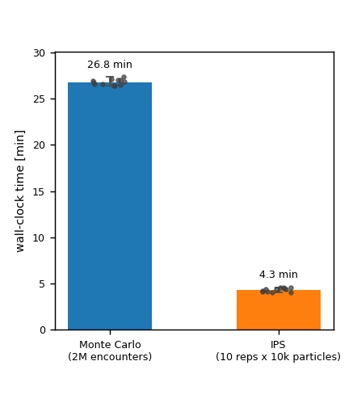

# Validation

An estimator for a number this small is only trustworthy if it has been checked where checking is still possible. This page checks IPS against plain Monte Carlo on **accuracy** — do the two agree? — and **efficiency** — what does agreement cost? — by running both across the whole CNS-uncertainty space. This page assumes the [theory](index.md) and the [run recipe](running.md).

## Accuracy and efficiency

The geometry is fixed (a 90° crossing, dead-on, `rpz` 50 m, lookahead 60 s, `MVP(margin=1.05)` + `PastCPA`, `dt` 0.2 s). Each cell runs a **2-million-encounter** Monte-Carlo anchor and IPS at **10 replications × 10 000 particles × 17 shells** (roughly 1.7 million particle-segments — the same order as Monte Carlo's 2 million full encounters, not a small fraction of it). Navigation uncertainty is a GNSS self-fix error (`pos_ci95`, with `vel_ci95` fixed at 1 m/s); communication uncertainty is a per-link reception probability `rx`.

**Accuracy.** Across the sweep, IPS' results closely matches Monte Carlo's:

<figure markdown="span">
  
  <figcaption>P(LoS) against reception probability, Monte Carlo vs IPS.</figcaption>
</figure>

**Efficiency.** Each cell was run twice: the original sweep, and a rerun of IPS alone (same config, same seeds) to check reproducibility. Every P(IPS) came back identical to six decimal places — a literal repeat of the same computation — and the rerun used a new lockstep task schedule (200 tasks/level spread over 100 workers, instead of one process per replication) that cut IPS's wall-clock cost by roughly 6×. Monte Carlo was not rerun, so its cost is unchanged; the figure below compares Monte Carlo against the current (rerun) IPS only.

<figure markdown="span">
  
  <figcaption>Wall-clock time per cell, mean across the twelve cells (whiskers: min–max; points: individual cells). IPS reaches the same estimate as Monte Carlo in about a sixth of the time.</figcaption>
</figure>

What the sweep shows:

- **IPS tracks Monte Carlo across the whole space.** Every cell sits at $10^{-4}$–$10^{-5}$ — the rare regime — and the two estimators agree to the same order.
- **No collapses anywhere** (0 / 10 in every cell). One 17-shell ladder held across probabilities spanning a factor of ten and two different uncertainty mechanisms — the fixed ladder, tuned once from the running-min percentiles, was robust across the sweep.

!!! warning "Learning from the first principles"
    It is highly recommended to understand the theory of rare-event simulation from primary sources before using this library, to understand your needs and interpret the results correctly.

In summary: within a regime Monte Carlo can still reach ($\sim 10^{-4}$–$10^{-5}$), IPS reproduces it across the experiments. That is the evidence needed before trusting it in the rarer regimes, where Monte Carlo cannot follow.
