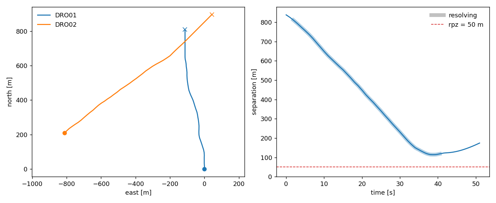

# T1. Under CNS uncertainty

T0 flew a pairwise conflict with the built-in `Performance` and `Kinematics` with the library, and with perfect information. The goal of this notebook is to demonstrate how to:

1. write your own `performance` and `kinematics`.
2. build the same pairwise conflict with `communication` and `navigation` uncertainty in it
3. run one encounter, then many, and estimate P(LoS) with your own loop

## T1.1. Your own performance envelope

`Performance` is a set of limits, and your job is to build a constructor. Suppose we want to have a fixed-wing with the performance as follow:

```python
from opencdarr import Performance

# some global variable first
RPZ = 50.0     # protected-zone radius [m]
DT = 0.5       # integration step [s]
G = 9.80665    # standard gravity [m/s2]

MY_FIXEDWING = Performance(
    v_max=24.0,          # never faster than this [m/s]
    v_min=13.0,          # stall speed: never slower than this [m/s]
    ax=1.8,              # acceleration along the flight path [m/s2]
    yaw_rate_max=0.0,    # it does not yaw on the spot
    phi_max=40.0,        # bank limit [deg] — this is the turn authority
    roll_rate_max=60.0,  # how fast the bank itself may change [deg/s]
)

print(MY_FIXEDWING)
```

```{ .text .output }
Performance(v_max=24.0, v_min=13.0, ax=1.8, yaw_rate_max=0.0, phi_max=40.0, roll_rate_max=60.0)
```

## T1.2. Your own kinematics

A `Kinematics` model is one class with one method. `step` is a state-transition map:

$$\mathbf{x}_{k+1} = f\left(\mathbf{x}_k,\; \mathbf{u}_k,\; \mathcal{P},\; \Delta t,\; \mathbf{W}\right)$$

$\mathbf{x}_k$ (`state`) is the `AircraftState` now: position, track, ground speed, yaw, bank. $\mathbf{u}_k$ (`command`) is the `MotionCommand` setpoint, of which you read the channels your vehicle understands and ignore the rest. The other three are context. $\mathcal{P}$ (`perf`) is the `Performance` envelope whose limits must be respected, $\Delta t$ (`dt`) is the step in seconds, and $\mathbf{W}$ (`wind`) is the field, a read-only environment input that is never stored on the state.

The model below is deliberately simple but still following a fixed-wing model. The detail of how the model is written is not explained here. The highlight is that the good practice aside from the `step` is to also include `validate_performance` so that you can protect the kinematics against unwanted performance.

Note that it is optional to include `odometry_update` to track the time and distance flown, the current version still doesn't calculate the distance-time flown metric. But it is within the plan.

```python
import dataclasses
import math
from dataclasses import replace

from opencdarr import AircraftState, Kinematics, MotionCommand, NO_WIND, WindField, geo
# from opencdarr.kinematics.base import odometry_update

class SimpleFixedWing(Kinematics):
    """A bank-limited point mass, commanded in ground velocity. Ignores the wind."""

    def validate_performance(self, perf: Performance) -> None:
        """Refuse an envelope this model would fly silently wrong (a multirotor's, typically)."""
        bad: list[str] = []
        if perf.v_min <= 0.0:
            bad.append("v_min is a stall speed here and must be > 0")
        if perf.phi_max <= 0.0:
            bad.append("phi_max must be > 0 (this model turns by banking)")
        if bad:
            raise ValueError(
                "SimpleFixedWing was given an envelope it cannot fly: " + "; ".join(bad)
                + ". Pass a fixed-wing Performance such as MY_FIXEDWING."
            )

    def step(
        self,
        state: AircraftState,
        command: MotionCommand,
        perf: Performance,
        dt: float,
        wind: WindField = NO_WIND,
    ) -> AircraftState:
        """Advance one step. `wind` is accepted and deliberately not read (see L1.7)."""
        # speed: clamp the commanded speed into the envelope, then ramp toward it at ax
        v_cmd = min(max(command.gs, perf.v_min), perf.v_max)
        v = state.gs + min(max(v_cmd - state.gs, -perf.ax * dt), perf.ax * dt)

        # track: turn toward the commanded direction, no faster than a bank of phi_max allows
        omega_max = math.degrees(G * math.tan(math.radians(perf.phi_max)) / max(v, 1e-9))
        error = ((command.trk - state.trk + 180.0) % 360.0) - 180.0
        trk = (state.trk + min(max(error, -omega_max * dt), omega_max * dt)) % 360.0

        # position: a great-circle step along the new track
        lat, lon = geo.forward(state.lat, state.lon, trk, v * dt)
        return replace(
            state, lat=lat, lon=lon, trk=trk, gs=v, yaw=trk,
            # **odometry_update(state, v, dt)
        )
```

## T1.3. A pairwise conflict, with comm and nav uncertainty

Let's build an encounter between M600 and MY_FIXEDWING. We set them at a conflict angle of 45°, distance at closest point of approach (CPA) of 0 m, time to loss-of-separation at 60 s. Like in T0, we use `create_conflict` to spawn the other one.

The CNS uncertainty is constructed using three different objects. **Navigation** is defined per aircraft in their `AircraftState` as `pos_ci95` and `vel_ci95`, position and velocity uncertainty of isotropic gaussian. Next, is the **Communication** which decides whether a broadcast arrives (this is a reception probability) and how late it should arrive. The communication is a directed link, so `AC1 → AC2` and `AC2 → AC1` can have a different reception probability, but when the link is not written it means they are the same for every aircraft. Lastly, **Surveillance** (`surveillance=LastKnown()`) decides what a receiver believes between messages: the last one that arrived, held until the next one does.

```python
from opencdarr import Comm, GnssNavigation, LastKnown
from opencdarr import StateBased, MVP, PastCPA
from opencdarr import Agent, M600, Multirotor
from opencdarr import create_aircraft, create_conflict, run_fleet
from opencdarr import generator, root_seed_sequence, spawn

from opencdarr.cns import lognormal_latency

POS_CI95, VEL_CI95 = 60.0, 3.0   # 95 % radial accuracy, position [m] and velocity [m/s]
CRUISE = 16.0                    # the ownship multirotor's cruise [m/s]
GS_INTR = 18.0                   # the intruder's cruise [m/s] (inside MY_FIXEDWING's envelope)

NAVIGATION = GnssNavigation()

COMMUNICATION = Comm(
    reception_prob={
        ("DRO01", "DRO02"): 0.7,   # DRO01 broadcasts, DRO02 hears 7 in 10
        ("DRO02", "DRO01"): 0.7,   # the reverse link, drawn separately
    },
    latency=lognormal_latency(median=0.5, sigma=0.6),
)

SURVEILLANCE = LastKnown()

# we create this function for ease-of-use
def encounter(seed: int, record: bool = False):
    """One encounter: the 45-degree crossing, flown under the CNS stack and `wind`."""
    nav_seq, comm_seq = spawn(root_seed_sequence(seed), 2)

    dro01 = create_aircraft(M600, id="DRO01", lat=52.0, lon=4.0, trk=0.0, gs=CRUISE,
                            pos_ci95=POS_CI95, vel_ci95=VEL_CI95)
    dro02 = create_conflict(dro01, intr_id="DRO02", dpsi=45.0, dcpa=0.0, tlos=60.0, rpz=RPZ,
                            gs_intr=GS_INTR, pos_ci95=POS_CI95, vel_ci95=VEL_CI95)

    agent_dro01 = Agent(dro01, M600, Multirotor())                  # a library airframe
    agent_dro02 = Agent(dro02, MY_FIXEDWING, SimpleFixedWing())     # the one we wrote

    return run_fleet(
        [agent_dro01, agent_dro02],
        rpz=RPZ, t_lookahead=120.0, dt=DT,
        detector=StateBased(), resolver=MVP(margin=1.05), recovery=PastCPA(),
        navigation=NAVIGATION, nav_rng=generator(nav_seq),
        communication=COMMUNICATION, surveillance=SURVEILLANCE, comm_rng=generator(comm_seq),
        t_max=600.0, done_timeout=10.0, record=record,
    )


run = encounter(seed=0, record=True)
print(run)
fig = run.plot(rpz=RPZ)
```

```{ .text .output }
FleetOutcome
  conflict  yes
  los       no
  min_sep   114.3 m | DRO01-DRO02
  ended     done_timeout (fleet stayed clear long enough)
  frames    StatesLog(103 frames, t=0.0→51.0s)
```

<figure markdown="span">
  
  <figcaption>One encounter at seed 0. The pair clears at 114.3 m, and the run ends at 51.0 s.</figcaption>
</figure>

In the code above, we do not specify the mission of the aircraft so it is set to the default: autopilot cruise.

But one encounter under CNS uncertainty says nothing, we need more samples.

```python
import time
t0 = time.perf_counter()

nb_los = 0
nb_samples = 3000

for seed in range(nb_samples):
    out = encounter(seed)
    nb_los = nb_los + 1 if out.los else nb_los

p_los = nb_los / nb_samples

print(f"P(LoS): {p_los:.4f} in {time.perf_counter() - t0:.1f} s")
```

```{ .text .output }
P(LoS): 0.0163 in 18.6 s
```

!!! code "Run it yourself"
    Every step on this page is the notebook [`examples/tutorial/T1_cns_uncertainty.ipynb`](https://github.com/fazlurnu/OpenCDaRR/blob/main/examples/tutorial/T1_cns_uncertainty.ipynb), top to bottom, and every number above is its own output. The figure is written by the notebook itself on the run that produced these numbers, so the page and the notebook cannot disagree about them.
